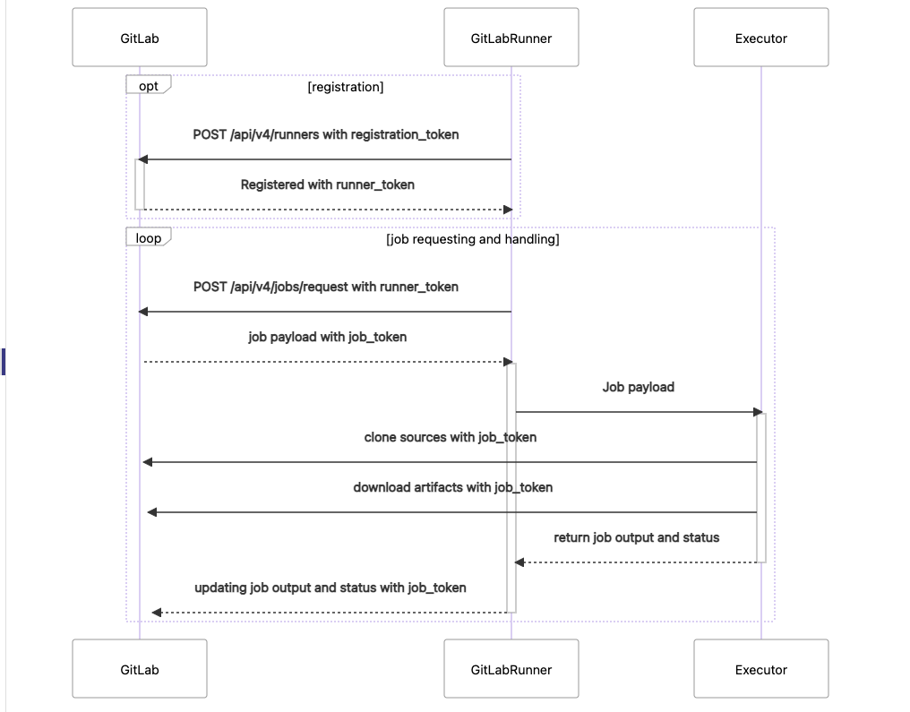
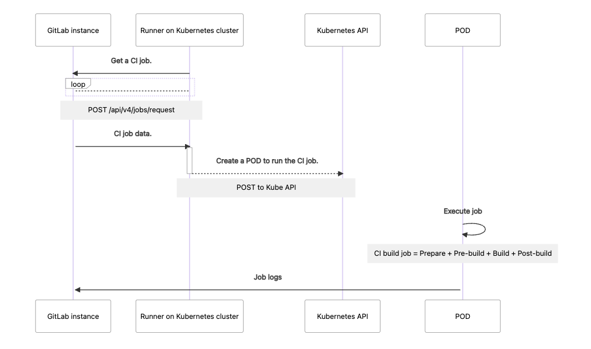

<!-- START doctoc generated TOC please keep comment here to allow auto update -->
<!-- DON'T EDIT THIS SECTION, INSTEAD RE-RUN doctoc TO UPDATE -->
**Table of Contents**  *generated with [DocToc](https://github.com/thlorenz/doctoc)*

- [gitlab-runner 源码分析(版本 v15.1.0-46)](#gitlab-runner-%E6%BA%90%E7%A0%81%E5%88%86%E6%9E%90%E7%89%88%E6%9C%AC-v1510-46)
  - [接口](#%E6%8E%A5%E5%8F%A3)
  - [注册 runner](#%E6%B3%A8%E5%86%8C-runner)
  - [作业请求和处理循环](#%E4%BD%9C%E4%B8%9A%E8%AF%B7%E6%B1%82%E5%92%8C%E5%A4%84%E7%90%86%E5%BE%AA%E7%8E%AF)
    - [请求获取job 信息](#%E8%AF%B7%E6%B1%82%E8%8E%B7%E5%8F%96job-%E4%BF%A1%E6%81%AF)
    - [找 executor 执行](#%E6%89%BE-executor-%E6%89%A7%E8%A1%8C)
  - [参考资料](#%E5%8F%82%E8%80%83%E8%B5%84%E6%96%99)

<!-- END doctoc generated TOC please keep comment here to allow auto update -->

# gitlab-runner 源码分析(版本 v15.1.0-46)



## 接口

```go
// /Users/python/Downloads/git_download/gitlab-runner/common/network.go
type Network interface {
	RegisterRunner(config RunnerCredentials, parameters RegisterRunnerParameters) *RegisterRunnerResponse
	VerifyRunner(config RunnerCredentials) bool
	UnregisterRunner(config RunnerCredentials) bool
	RequestJob(ctx context.Context, config RunnerConfig, sessionInfo *SessionInfo) (*JobResponse, bool)
	UpdateJob(config RunnerConfig, jobCredentials *JobCredentials, jobInfo UpdateJobInfo) UpdateJobResult
	PatchTrace(config RunnerConfig, jobCredentials *JobCredentials, content []byte, startOffset int) PatchTraceResult
	DownloadArtifacts(config JobCredentials, artifactsFile io.WriteCloser, directDownload *bool) DownloadState
	UploadRawArtifacts(config JobCredentials, reader io.ReadCloser, options ArtifactsOptions) (UploadState, string)
	ProcessJob(config RunnerConfig, buildCredentials *JobCredentials) (JobTrace, error)
}
```
## 注册 runner 
在安装GitLab Runner后，我们需要执行注册这个动作，该动作需要两个重要参数就是GitLab 的Host，以及注册令牌token，有了这两个参数，我们就能将GitLab Runner与GitLab 对接起来。
在这一过程中GitLab Runner使用POST请求方式，调用的是/api/v4/runner接口，并携带了注册令牌token。
注册成功后GitLab，GitLab实例保存注册的Runner信息，包括tags，runner描述，IP等信息,并且会给GitLab Runner返回一个状态，并携带了runner_token。GitLab Runner接受到返回的成功状态后，会在它的配置文件中新增一个runner的配置记录


runner 配置信息
```toml
concurrent = 1
check_interval = 0

[session_server]
  session_timeout = 1800

[[runners]]
  name = "test-runner"
  url = "https://gitlab.com"
  token = "__REDACTED__"
  executor = "kubernetes"
  [runners.cache]
    [runners.cache.s3]
    [runners.cache.gcs]
  [runners.kubernetes]
    host = "http://localhost:9876/"
    bearer_token_overwrite_allowed = false
    image = ""
    namespace = ""
    namespace_overwrite_allowed = ""
    privileged = false
    service_account_overwrite_allowed = ""
    pod_labels_overwrite_allowed = ""
    pod_annotations_overwrite_allowed = ""
    [runners.kubernetes.volumes]
```

初始化网络客户端
```go
// /Users/python/Downloads/git_download/gitlab-runner/commands/multi.go
func init() {
	requestStatusesCollector := network.NewAPIRequestStatusesMap()

	common.RegisterCommand2(
		"run",
		"run multi runner service",
		&RunCommand{
			ServiceName:                     defaultServiceName,
			// network 实例化
			network:                         network.NewGitLabClientWithRequestStatusesMap(requestStatusesCollector),
			networkRequestStatusesCollector: requestStatusesCollector,
			prometheusLogHook:               prometheus_helper.NewLogHook(),
			failuresCollector:               prometheus_helper.NewFailuresCollector(),
			buildsHelper:                    newBuildsHelper(),
		},
	)
}

// 初始化 gitlab client 请求客户端
func NewGitLabClientWithRequestStatusesMap(rsMap *APIRequestStatusesMap) *GitLabClient {
	return &GitLabClient{
		requestsStatusesMap: rsMap,
	}
}
```

具体的注册流程
```go
func (n *GitLabClient) RegisterRunner(
	runner common.RunnerCredentials,
	parameters common.RegisterRunnerParameters,
) *common.RegisterRunnerResponse {
	// 请求体
	request := common.RegisterRunnerRequest{
		// runner 的配置信息
		RegisterRunnerParameters: parameters,
		// 注册需要带上的 Token
		Token:                    runner.Token,
		Info:                     n.getRunnerVersion(common.RunnerConfig{}),
	}

	var response common.RegisterRunnerResponse
	
	// 发送请求
	result, statusText, resp := n.doJSON(
		context.Background(),
		&runner,
		http.MethodPost,
		// 路径 uri 是 runners
		"runners",
		http.StatusCreated,
		&request,
		&response,
	)
	if resp != nil {
		defer func() { _ = resp.Body.Close() }()
	}

	// 对状态进行分类处理
	switch result {
	case http.StatusCreated:
		// 创建成功
		runner.Log().Println("Registering runner...", "succeeded")
		return &response
	case http.StatusForbidden:
		runner.Log().Errorln("Registering runner...", "forbidden (check registration token)")
		return nil
	case clientError:
		runner.Log().WithField("status", statusText).Errorln("Registering runner...", "error")
		return nil
	default:
		runner.Log().WithField("status", statusText).Errorln("Registering runner...", "failed")
		return nil
	}
}
```

```go
func (n *GitLabClient) doJSON(
	ctx context.Context,
	credentials requestCredentials,
	method, uri str ing,
	statusCode int,
	request interface{},
	response interface{},
) (int, string, *http.Response) {
	// 获取 client 
	c, err := n.getClient(credentials)
	if err != nil {
		return clientError, err.Error(), nil
	}

	return c.doJSON(ctx, uri, method, statusCode, request, response)
}
```

获取client连接
```go
func (n *GitLabClient) getClient(credentials requestCredentials) (c *client, err error) {
	n.lock.Lock()
	defer n.lock.Unlock()

	if n.clients == nil {
		n.clients = make(map[string]*client)
	}
	key := fmt.Sprintf(
		"%s_%s_%s_%s",
		credentials.GetURL(),
		credentials.GetToken(),
		credentials.GetTLSCAFile(),
		credentials.GetTLSCertFile(),
	)
	c = n.clients[key]
	if c == nil {
		// 生成连接
		c, err = newClient(credentials)
		if err != nil {
			return
		}
		n.clients[key] = c
	}

	return
}

func newClient(requestCredentials requestCredentials) (*client, error) {
	// 请求的默认前缀(注意后面的 / 符号)
	url, err := url.Parse(fixCIURL(requestCredentials.GetURL()) + "/api/v4/")
	if err != nil {
		return nil, err
	}

	if url.Scheme != "http" && url.Scheme != "https" {
		return nil, errors.New("only http or https scheme supported")
	}

	c := &client{
		url:             url,
		caFile:          requestCredentials.GetTLSCAFile(),
		certFile:        requestCredentials.GetTLSCertFile(),
		keyFile:         requestCredentials.GetTLSKeyFile(),
		requestBackOffs: make(map[string]*backoff.Backoff),
	}
	c.requester = newRateLimitRequester(&c.Client)

	host := strings.Split(url.Host, ":")[0]
	if CertificateDirectory != "" {
		c.findCertificate(&c.caFile, CertificateDirectory, host+".crt")
		c.findCertificate(&c.certFile, CertificateDirectory, host+".auth.crt")
		c.findCertificate(&c.keyFile, CertificateDirectory, host+".auth.key")
	}

	return c, nil
}
```

真正的发送
```go
func (n *client) doJSON(
	ctx context.Context,
	uri, method string,
	statusCode int,
	request interface{},
	response interface{},
) (int, string, *http.Response) {
	var body io.Reader

	if request != nil {
		requestBody, err := json.Marshal(request)
		if err != nil {
			return -1, fmt.Sprintf("failed to marshal project object: %v", err), nil
		}
		body = bytes.NewReader(requestBody)
	}

	headers := make(http.Header)
	if response != nil {
		headers.Set("Accept", jsonMimeType)
	}

	res, err := n.do(ctx, uri, method, body, jsonMimeType, headers)
	if err != nil {
		return -1, err.Error(), nil
	}
	defer func() {
		_, _ = io.Copy(ioutil.Discard, res.Body)
		_ = res.Body.Close()
	}()

	status := getMessageFromJSONResponse(res)
	if res.StatusCode == statusCode && response != nil {
		isApplicationJSON, err := isResponseApplicationJSON(res)
		if !isApplicationJSON {
			return -1, err.Error(), nil
		}

		d := json.NewDecoder(res.Body)
		err = d.Decode(response)
		if err != nil {
			return -1, fmt.Sprintf("Error decoding json payload %v", err), nil
		}
	}

	n.setLastUpdate(res.Header)

	return res.StatusCode, status, res
}

```


## 作业请求和处理循环

在注册runner成功后，runner就可以开始工作了，在触发流水线会，runner会进入一个循环，首先runner会使用POST方法向GitLab调用/api/v4/jobs/request方法，调用时携带runner_token。

接着GitLab 返回作业的负载给GitLab Runner，在这一过程中，也返回了一个job_token。

GitLab Runner 拿到作业负载会，会去执行器中取执行。

执行器执行开始时，会首先使用job_token去克隆项目完整代码，并且下载制品。

执行器的运行日志也会发送给GitLab，这样用户就能看到执行器中的所有日志了。

执行器，运行作业负载后，会将状态返回给GitLab Runner，再由GitLab Runner告诉GitLab 当作业的状态和输出。


```go
func (mr *RunCommand) processRunner(
	id int,
	runner *common.RunnerConfig,
	runners chan *common.RunnerConfig,
) (err error) {
	provider := common.GetExecutorProvider(runner.Executor)
	if provider == nil {
		return
	}

	executorData, err := provider.Acquire(runner)
	if err != nil {
		return fmt.Errorf("failed to update executor: %w", err)
	}
	defer provider.Release(runner, executorData)

	if !mr.buildsHelper.acquireBuild(runner) {
		logrus.WithFields(logrus.Fields{
			"runner": runner.ShortDescription(),
			"worker": id,
		}).Debug("Failed to request job, runner limit met")
		return
	}
	defer mr.buildsHelper.releaseBuild(runner)

	buildSession, sessionInfo, err := mr.createSession(provider)
	if err != nil {
		return
	}

	// Receive a new build
	trace, jobData, err := mr.requestJob(runner, sessionInfo)
	if err != nil || jobData == nil {
		return
	}
	defer func() { mr.traceOutcome(trace, err) }()

	// 构建 build 相关的信息,比如 runner 
	build, err := common.NewBuild(*jobData, runner, mr.abortBuilds, executorData)
	if err != nil {
		return
	}
	build.Session = buildSession
	build.ArtifactUploader = mr.network.UploadRawArtifacts

	// Add build to list of builds to assign numbers
	mr.buildsHelper.addBuild(build)
	defer mr.buildsHelper.removeBuild(build)

	// Process the same runner by different worker again
	// to speed up taking the builds
	mr.requeueRunner(runner, runners)

	// 获取executor 执行 
	return build.Run(mr.config, trace)
}
```

### 请求获取job 信息
```go
// /Users/python/Downloads/git_download/gitlab-runner/network/gitlab.go
func (n *GitLabClient) RequestJob(
	ctx context.Context,
	config common.RunnerConfig,
	sessionInfo *common.SessionInfo,
) (*common.JobResponse, bool) {
	request := common.JobRequest{
		Info:       n.getRunnerVersion(config),
		Token:      config.Token,
		LastUpdate: n.getLastUpdate(&config.RunnerCredentials),
		Session:    sessionInfo,
	}

	var response common.JobResponse
	result, statusText, httpResponse := n.doJSON(
		ctx,
		&config.RunnerCredentials,
		http.MethodPost,
		"jobs/request",
		http.StatusCreated,
		&request,
		&response,
	)

	n.requestsStatusesMap.Append(config.RunnerCredentials.ShortDescription(), APIEndpointRequestJob, result)

	switch result {
	case http.StatusCreated:
		config.Log().WithFields(logrus.Fields{
			"job":      response.ID,
			"repo_url": response.RepoCleanURL(),
		}).Println("Checking for jobs...", "received")

		tlsData, err := n.getResponseTLSData(&config.RunnerCredentials, httpResponse)
		if err != nil {
			config.Log().
				WithError(err).Errorln("Error on fetching TLS Data from API response...", "error")
		}
		addTLSData(&response, tlsData)

		return &response, true
	case http.StatusForbidden:
		config.Log().Errorln("Checking for jobs...", "forbidden")
		return nil, false
	case http.StatusNoContent:
		config.Log().Debugln("Checking for jobs...", "nothing")
		return nil, true
	case clientError:
		config.Log().WithField("status", statusText).Errorln("Checking for jobs...", "error")
		return nil, false
	default:
		config.Log().WithField("status", statusText).Warningln("Checking for jobs...", "failed")
		return nil, true
	}
}
```

### 找 executor 执行
```go
func (b *Build) Run(globalConfig *Config, trace JobTrace) (err error) {
	var executor Executor

	b.ExecutorName = func() string {
		return executor.Name()
	}

    // trace 相关
    // ...

	options := b.createExecutorPrepareOptions(ctx, globalConfig, trace)
	provider := GetExecutorProvider(b.Runner.Executor)
	if provider == nil {
		return errors.New("executor not found")
	}

	// 获取 执行器 相关信息
	err = provider.GetFeatures(&b.ExecutorFeatures)
	if err != nil {
		return fmt.Errorf("retrieving executor features: %w", err)
	}

	executor, err = b.executeBuildSection(executor, options, provider)

	if err == nil {
		// 开始执行
		err = b.run(ctx, executor)
		if errWait := b.waitForTerminal(ctx, globalConfig.SessionServer.GetSessionTimeout()); errWait != nil {
			b.Log().WithError(errWait).Debug("Stopped waiting for terminal")
		}
	}

	if executor != nil {
		executor.Finish(err)
	}

	return err
}
```

这里拿 kubernetes 执行器

```go
///Users/python/Downloads/git_download/gitlab-runner/executors/kubernetes/kubernetes.go
func (s *executor) Run(cmd common.ExecutorCommand) error {
	for attempt := 1; ; attempt++ {
		var err error

		if s.Build.IsFeatureFlagOn(featureflags.UseLegacyKubernetesExecutionStrategy) {
			s.Debugln("Starting Kubernetes command...")
			err = s.runWithExecLegacy(cmd)
		} else {
			s.Debugln("Starting Kubernetes command with attach...")
			err = s.runWithAttach(cmd)
		}

		var imagePullErr *pull.ImagePullError
		if errors.As(err, &imagePullErr) {
			if s.pullManager.UpdatePolicyForImage(attempt, imagePullErr) {
				s.cleanupResources()
				s.pod = nil
				continue
			}
		}
		return err
	}
}
```
拿attach 为例
```go
func (s *executor) runWithAttach(cmd common.ExecutorCommand) error {
	// 起 pod 
	err := s.ensurePodsConfigured(cmd.Context)
	if err != nil {
		return err
	}

	ctx, cancel := context.WithCancel(cmd.Context)
	defer cancel()

	containerName, containerCommand := s.getContainerInfo(cmd)

	s.Debugln(fmt.Sprintf(
		"Starting in container %q the command %q with script: %s",
		containerName,
		containerCommand,
		cmd.Script,
	))

	podStatusCh := s.watchPodStatus(ctx)

	select {
	case err := <-s.runInContainer(containerName, containerCommand):
		s.Debugln(fmt.Sprintf("Container %q exited with error: %v", containerName, err))
		var terminatedError *commandTerminatedError
		if err != nil && errors.As(err, &terminatedError) {
			return &common.BuildError{Inner: err, ExitCode: terminatedError.exitCode}
		}

		return err
	case err := <-podStatusCh:
		if IsKubernetesPodNotFoundError(err) {
			return err
		}

		return &common.BuildError{Inner: err}
	case <-ctx.Done():
		return fmt.Errorf("build aborted")
	}
}
```

```go
func (s *executor) ensurePodsConfigured(ctx context.Context) error {
	if s.pod != nil {
		return nil
	}

	// docker 拉取镜像 用secret 信息
	err := s.setupCredentials()
	if err != nil {
		return fmt.Errorf("setting up credentials: %w", err)
	}

	// shell 命令放入 configmap
	err = s.setupScriptsConfigMap()
	if err != nil {
		return fmt.Errorf("setting up scripts configMap: %w", err)
	}

	// 配置 init permissions 容器信息
	permissionsInitContainer, err := s.buildPermissionsInitContainer(s.helperImageInfo.OSType)
	if err != nil {
		return fmt.Errorf("building permissions init container: %w", err)
	}
	// 构建 pod
	err = s.setupBuildPod([]api.Container{permissionsInitContainer})
	if err != nil {
		return fmt.Errorf("setting up build pod: %w", err)
	}

	// 检查状态
	status, err := waitForPodRunning(ctx, s.kubeClient, s.pod, s.Trace, s.Config.Kubernetes)
	if err != nil {
		return fmt.Errorf("waiting for pod running: %w", err)
	}

	if status != api.PodRunning {
		return fmt.Errorf("pod failed to enter running state: %s", status)
	}

	go s.processLogs(ctx)

	return nil
}
```

## 参考资料
1. [gitlab kubernetes 执行器](https://docs.gitlab.com/15.1/runner/executors/kubernetes.html)