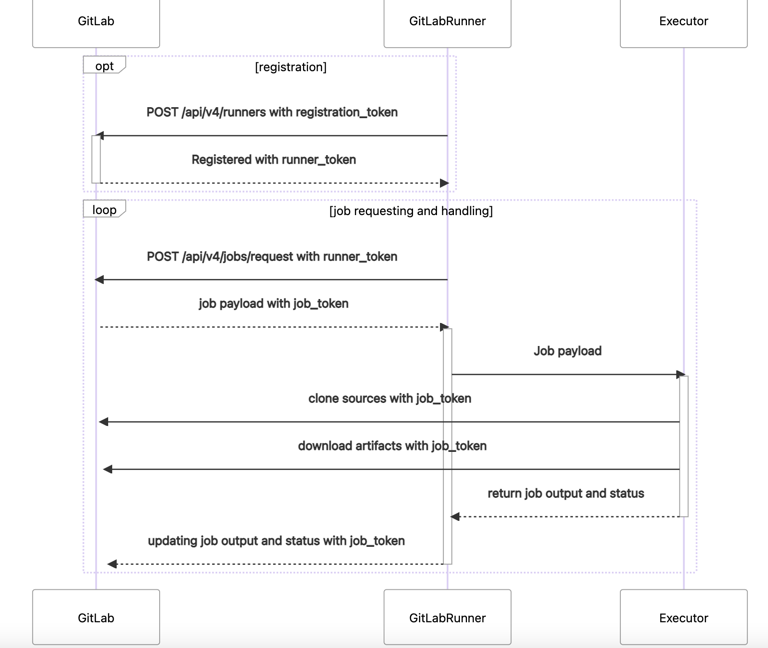

# CI持续集成（Continuous Integration）

持续集成（Continuous Integration）是一种软件开发实践，即团队开发成员经常集成它们的工作，通过每个成员每天至少集成一次，也就意味着每天可能会发生多次集成。
每次集成都通过自动化的构建（包括编译，发布，自动化测试）来验证，从而尽早地发现集成错误。

## gitlab CI

GitLab CI 是GitLab内置的进行持续集成的工具，只需要在仓库根目录下创建.gitlab-ci.yml 文件，并配置GitLab Runner；每次提交的时候，gitlab将自动识别到.gitlab-ci.yml文件，并且使用Gitlab Runner执行该脚本。

.gitlab-ci.yml遵循YAML文件的语法，这份文件记录了你想要执行的各种指令，这些指令可以用来对你的代码进行规范检查（例如PEP8）、自动打包（例如Android自动打包）、自动部署等。

### Gitlab Runner

GitLab-Runner就是一个用来执行.gitlab-ci.yml 脚本的工具。可以理解成，Runner就像认真工作的工人，GitLab-CI就是管理工人的中心，所有工人都要在GitLab-CI里面注册，并且表明自己是为哪个项目服务。
当相应的项目发生变化时，GitLab-CI就会通知相应的工人执行对应的脚本。

#### GitLab Runner特点
- 可以并行执行多个job
- 可以每个project的token不同
- 可以限制每个token对应的并发度
- 可以运行在 本地，docker,ssh到远程服务器
- Go编写，跨平台
- 可以利用docker 的缓存
- 可以内置prometheus进行监控

#### Runner类型
GitLab-Runner可以分类三种类型：Shared Runner（共享型）和Group runners,Specific Runner（指定型）

- Shared Runner：所有工程都能够用的，且只有系统管理员能够创建。
- Group runners: 组下所有项目和子组都可以使用。
- Specific Runner：只有特定的项目可以使用。

#### runner注册
相同的主机可能注册多个runner并且配置可以不同

### 基本概念

#### 管道（pipeline）：
每个推送到 Gitlab 的提交都会产生一个与该提交关联的管道(pipeline)，若一次推送包含了多个提交，则管道与最后那个提交相关联，管道(pipeline)就是一个分成不同阶段(stage)的作业(job)的集合。

### 阶段（Stage）
阶段是对批量的作业的一个逻辑上的划分，每个 GitLab CI/CD 都必须包含至少一个 Stage。多个 Stage 是按照顺序执行的，如果其中任何一个 Stage 失败，则后续的 Stage 不会被执行，整个 CI 过程被认为失败。

### Job
作业就是运行器(Runner)要执行的指令集合，Job 可以被关联到一个 Stage。当一个 Stage 执行的时候，与其关联的所有 Job 都会被执行。在有足够运行器的前提下,同一阶段的所有作业会并发执行。作业状态与阶段状态是一样的，实际上，阶段的状态就是继承自作业的

作业必须包含script（由Runner执行的shell脚本），随着项目越来越大，Job 越来越多，Job 中包含的重复逻辑可能会让配置文件臃肿不堪。.gitlab-ci.yml 中提供了 before_script 和 after_script 两个全局配置项。这两个配置项在所有 Job 的 script 执行前和执行后调用

Job 的执行过程中往往会产生一些数据，默认情况下 GitLab Runner 会保存 Job 生成的这些数据，然后在下一个 Job 执行之前（甚至不局限于当次 CI/CD）将这些数据恢复。这样即便是不同的 Job 运行在不同的 Runner 上，它也能看到彼此生成的数据

Job执行流程

### 验证.gitlab-ci.yml

GitLab CI的每个实例都有一个名为Lint的嵌入式调试工具，它可以验证.gitlab-ci.yml文件的内容，进入项目仓库->CI/CD->CI Lint，示例如下：

## 参考资料
1. [gitlab官网](https://docs.gitlab.com/runner/register/)
