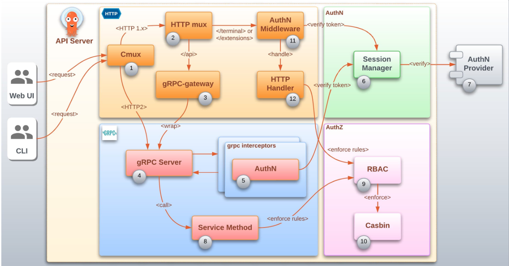

<!-- START doctoc generated TOC please keep comment here to allow auto update -->
<!-- DON'T EDIT THIS SECTION, INSTEAD RE-RUN doctoc TO UPDATE -->
**Table of Contents**  *generated with [DocToc](https://github.com/thlorenz/doctoc)*

- [casbin 权限管理](#casbin-%E6%9D%83%E9%99%90%E7%AE%A1%E7%90%86)
  - [背景](#%E8%83%8C%E6%99%AF)
  - [前置知识:访问控制模型](#%E5%89%8D%E7%BD%AE%E7%9F%A5%E8%AF%86%E8%AE%BF%E9%97%AE%E6%8E%A7%E5%88%B6%E6%A8%A1%E5%9E%8B)
    - [1 UGO(User, Group, Other)](#1-ugouser-group-other)
    - [2 DAC（discretionary access control 自主访问控制）](#2-dacdiscretionary-access-control-%E8%87%AA%E4%B8%BB%E8%AE%BF%E9%97%AE%E6%8E%A7%E5%88%B6)
    - [3 RBAC(role-based-access-control 基于角色的权限访问控制)](#3-rbacrole-based-access-control-%E5%9F%BA%E4%BA%8E%E8%A7%92%E8%89%B2%E7%9A%84%E6%9D%83%E9%99%90%E8%AE%BF%E9%97%AE%E6%8E%A7%E5%88%B6)
    - [4 ABAC(Attribute-based access control 基于属性的权限验证)](#4-abacattribute-based-access-control-%E5%9F%BA%E4%BA%8E%E5%B1%9E%E6%80%A7%E7%9A%84%E6%9D%83%E9%99%90%E9%AA%8C%E8%AF%81)
  - [使用](#%E4%BD%BF%E7%94%A8)
  - [案例](#%E6%A1%88%E4%BE%8B)

<!-- END doctoc generated TOC please keep comment here to allow auto update -->

# casbin 权限管理

权限实际上就是控制谁能对什么资源进行什么操作。
casbin将访问控制模型抽象到一个基于 PERM（Policy，Effect，Request，Matchers） 元模型的配置文件（模型文件）中。因此切换或更新授权机制只需要简单地修改配置文件。
```go
var sectionNameMap = map[string]string{
	"r": "request_definition",
	"p": "policy_definition",
	"g": "role_definition",
	"e": "policy_effect",
	"m": "matchers",
}
```

- policy是策略或者说是规则的定义。它定义了具体的规则。

- request是对访问请求的抽象，它与e.Enforce()函数的参数是一一对应的

- matcher匹配器会将请求与定义的每个policy一一匹配，生成多个匹配结果。

- effect根据对请求运用匹配器得出的所有结果进行汇总，来决定该请求是允许还是拒绝。

Model CONF 文件可以包含注释。注释以 # 开头， # 会注释该行剩余部分。


## 背景
权限管理在几乎每个系统中都是必备的模块。如果项目开发每次都要实现一次权限管理，无疑会浪费开发时间，增加开发成本。

我们理想中的情况就是：可以在中间件中，统一对用户进行鉴权，如果没有权限，中止继续访问，返回 HTTP status code 403，而如果有权限，则放行。

那么，再具体细化，就是这个权限引擎应该给我们提供至少以下几个接口：

- 判断某个用户 ID 是否具有权限;
- 管理用户角色，甚至角色组;
- 管理角色的权限，即可以对那些资源进行什么样的操作;


## 前置知识:访问控制模型

### 1 UGO(User, Group, Other)

这个是Linux中对于资源进行权限管理的访问模型。Linux中一切资源都是文件，UGO把操作当前文件的进程分为3种类型：

- User用户。文件的属主，即主体进程的euid等于客体文件的uid。
- Group同组用户。即主体进程的 egid 等于客体文件的gid。
- Other用户。不满足上述两种条件的其他用户
这种访问模型的缺点很明显，只能为一类用户设置权限，如果这类用户中有特殊的人，那么它无能为力了

### 2 DAC（discretionary access control 自主访问控制）
DAC思想：进程与其执行用户，拥有相同的权限。
例如：进程A，以root用户执行，进程A就拥有了root用户的权限。

DAC访问控制的实现：ACL(访问控制列表 Access Control List)  
原理是，每个资源都配置有一个列表，这个列表记录哪些用户可以对这项资源进行CRUD操作。
当系统试图访问这项资源的时候，会首先检查这个列表中是否有关于当前用户的访问权限，从而确定这个用户是否有权限访问当前资源.linux在UGO之外，也增加了这个功能。

```shell
$ sudo apt install acl
```


### 3 RBAC(role-based-access-control 基于角色的权限访问控制)
ACL模型在用户和资源都比较少的情况下没什么问题，但是用户和资源量一大，ACL就会变得异常繁琐。想象一下，每次新增一个用户，都要把他需要的权限重新设置一遍是多么地痛苦。
RBAC模型通过引入角色（role）这个中间层来解决这个问题。

每个用户都属于一个角色，例如开发者、管理员、运维等，每个角色都有其特定的权限，权限的增加和删除都通过角色来进行。
这样新增一个用户时，我们只需要给他指派一个角色，他就能拥有该角色的所有权限。修改角色的权限时，属于这个角色的用户权限就会相应的修改。


### 4 ABAC(Attribute-based access control 基于属性的权限验证)
这种权限验证模式是用属性来标记资源权限的。

属性通常来说分为四类：

- 用户属性（如用户年龄)
- 环境属性（如当前时间）
- 操作属性（如读取)
- 对象属性（如一篇文章，又称资源属性）

我们在不同的时间段对数据data实现不同的权限控制。正常工作时间9:00-18:00所有人都可以读写data，其他时间只有数据所有者能读写。
这种需求我们可以很方便地使用ABAC（attribute base access list）模型完成.


## 使用
casbin的使用非常精炼。基本上就生成一个结构，Enforcer，构造这个结构的时候加载 model.conf 和 policy.csv。
其中 model.conf 存储的是我们的访问控制模型，policy.csv 存储的是我们具体的用户权限配置。

[model 语法](https://casbin.org/docs/syntax-for-models)


## 案例

### argocd(rbac 模型)
[argocd Authentication and Authorization](https://argo-cd.readthedocs.io/en/stable/developer-guide/architecture/authz-authn/)



## 源码分析
初始化
```go
func (e *Enforcer) InitWithAdapter(modelPath string, adapter persist.Adapter) error {
	m, err := model.NewModelFromFile(modelPath)
	if err != nil {
		return err
	}

	err = e.InitWithModelAndAdapter(m, adapter)
	if err != nil {
		return err
	}

	e.modelPath = modelPath
	return nil
}
```


加载模型文件: 从文件中
```go
// NewModelFromFile creates a model from a .CONF file.
func NewModelFromFile(path string) (Model, error) {
	m := NewModel()

	err := m.LoadModel(path)
	if err != nil {
		return nil, err
	}

	return m, nil
}

```

模型结构体
```go
// Model represents the whole access control model.
type Model map[string]AssertionMap

// AssertionMap is the collection of assertions, can be "r", "p", "g", "e", "m".
type AssertionMap map[string]*Assertion
```


```go
// 根据 model 和 数据库adapter 来初始化
func (e *Enforcer) InitWithModelAndAdapter(m model.Model, adapter persist.Adapter) error {
	e.adapter = adapter

	e.model = m
	m.SetLogger(e.logger)
	e.model.PrintModel()
	e.fm = model.LoadFunctionMap()

	e.initialize()

	// Do not initialize the full policy when using a filtered adapter
	fa, ok := e.adapter.(persist.FilteredAdapter)
	if e.adapter != nil && (!ok || ok && !fa.IsFiltered()) {
		err := e.LoadPolicy()
		if err != nil {
			return err
		}
	}
    return nil
}
```


判断当前请求是否有权限


## 参考

- [casbin 支持的模型](https://casbin.org/zh/docs/supported-models)


