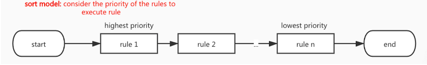
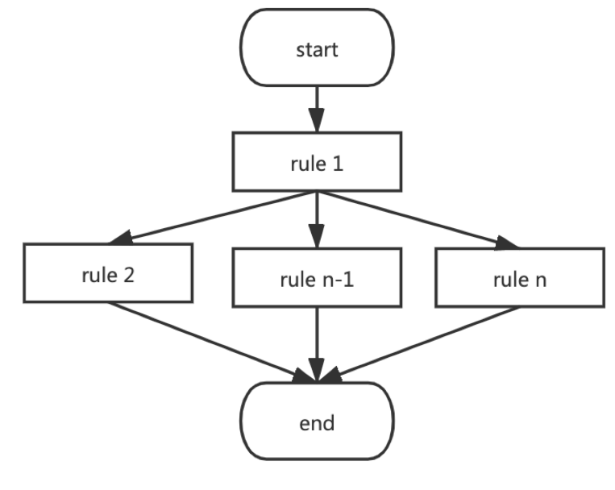
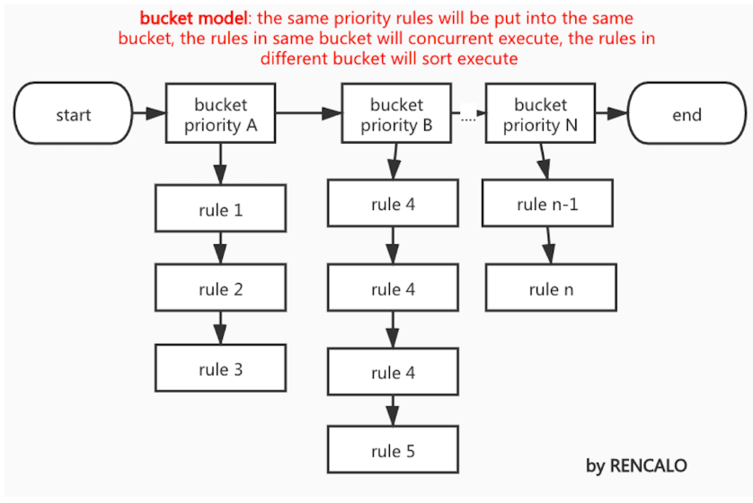

<!-- START doctoc generated TOC please keep comment here to allow auto update -->
<!-- DON'T EDIT THIS SECTION, INSTEAD RE-RUN doctoc TO UPDATE -->
**Table of Contents**  *generated with [DocToc](https://github.com/thlorenz/doctoc)*

- [rules engine 规则引擎](#rules-engine-%E8%A7%84%E5%88%99%E5%BC%95%E6%93%8E)
  - [背景](#%E8%83%8C%E6%99%AF)
  - [当前开源](#%E5%BD%93%E5%89%8D%E5%BC%80%E6%BA%90)
  - [规则的执行模式](#%E8%A7%84%E5%88%99%E7%9A%84%E6%89%A7%E8%A1%8C%E6%A8%A1%E5%BC%8F)
    - [1 顺序模式(sort model)](#1-%E9%A1%BA%E5%BA%8F%E6%A8%A1%E5%BC%8Fsort-model)
    - [2 并发执行模式(concurrent model)](#2-%E5%B9%B6%E5%8F%91%E6%89%A7%E8%A1%8C%E6%A8%A1%E5%BC%8Fconcurrent-model)
    - [3 混合执行模式（mix model）](#3-%E6%B7%B7%E5%90%88%E6%89%A7%E8%A1%8C%E6%A8%A1%E5%BC%8Fmix-model)
    - [4 桶排序(bucket model)](#4-%E6%A1%B6%E6%8E%92%E5%BA%8Fbucket-model)
  - [参考](#%E5%8F%82%E8%80%83)

<!-- END doctoc generated TOC please keep comment here to allow auto update -->

# rules engine 规则引擎

规则引擎由是一种嵌入在应用程序中的组件，实现了将业务决策从应用程序代码中分离出来，并使用预定义的语义模块编写业务决策。

## 背景 

## 当前开源

- https://github.com/Knetic/govaluate
- https://github.com/rencalo770/gengine: 应用于B站风控系统、流量投放系统、AB测试、推荐平台系统等多个业务场景
- https://github.com/apache/incubator-kie-drools: java 实现
- https://github.com/SpikeWong/gorule
- https://github.com/PaesslerAG/gval
- https://github.com/expr-lang/expr Argo integrates Expr into Argo Rollouts and Argo Workflows for Kubernetes.

## 规则的执行模式

### 1 顺序模式(sort model)

规则优先级高越高的越先执行，规则优先级低的越后执行。这也是 drools 支持的模式。此模式的缺点很明显：随着规则链越来越长，执行规则返回的速度也越来越慢

### 2 并发执行模式(concurrent model)

在此执行模式下，多个规则执行时，不考虑规则之间的优先级，规则与规则之间并发执行。规则执行的返回的速度等于所有规则中的执行时间最长的那个规则的速度（逆木桶原理）。执行性能优异，但无法满足规则优先级。

### 3 混合执行模式（mix model）

规则引擎选择一个优先级最高规则的最先执行，剩下的规则并发执行。规则执行返回耗时= 最高优先级的那个规则执行时间 + 并发执行中执行时间最长的那个规则耗时；此模式兼顾优先级和性能，适合于有豁免规则(或前置规则)的场景。

### 4 桶排序(bucket model)

规则引擎基于规则优先级进行分桶，优先级相同的规则置于同一个桶中，桶内的规则并发执行，桶间的规则基于规则优先级顺序执行

## 参考

- [B 站新一代 golang 规则引擎的设计与实现](https://xie.infoq.cn/article/40bfff1fbca1867991a1453ac)