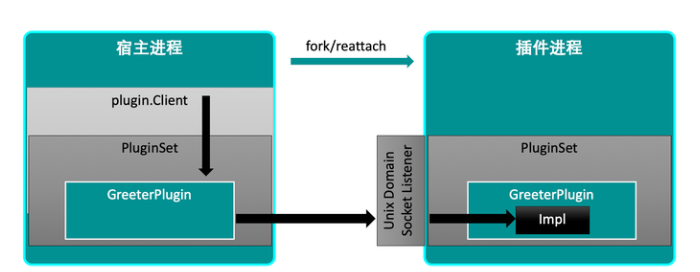

<!-- START doctoc generated TOC please keep comment here to allow auto update -->
<!-- DON'T EDIT THIS SECTION, INSTEAD RE-RUN doctoc TO UPDATE -->
**Table of Contents**  *generated with [DocToc](https://github.com/thlorenz/doctoc)*

- [github.com/hashicorp/go-plugin](#githubcomhashicorpgo-plugin)
  - [架构优势](#%E6%9E%B6%E6%9E%84%E4%BC%98%E5%8A%BF)
  - [go-plugin的特性](#go-plugin%E7%9A%84%E7%89%B9%E6%80%A7)
  - [适用场景](#%E9%80%82%E7%94%A8%E5%9C%BA%E6%99%AF)
  - [使用参考](#%E4%BD%BF%E7%94%A8%E5%8F%82%E8%80%83)
  - [第三方使用](#%E7%AC%AC%E4%B8%89%E6%96%B9%E4%BD%BF%E7%94%A8)
  - [参考](#%E5%8F%82%E8%80%83)

<!-- END doctoc generated TOC please keep comment here to allow auto update -->

# github.com/hashicorp/go-plugin

Go语言缺乏动态加载代码的机制，Go程序通常是独立的二进制文件，因此难以实现类似于C++的插件系统.


## 架构优势

- 插件不影响宿主机进程：插件崩溃了，不会导致宿主进程崩溃
- 插件容易编写：仅仅写个go应用程序并执行go build。或者使用其他语言来编写gRPC服务 ，加上少量的模板来支持go-plugin。
- 易于安装：只需要将插件放到宿主进程能够访问的目录即可，剩下的事情由宿主进程来处理。
- 完整性校验：支持对插件的二进制文件进行Checksum
- 插件是相对安全的：插件只能访问传递给它的接口和参数，而不是进程的整个内存空间。另外，go-plugin可以基于TLS和插件进行通信


## go-plugin的特性

插件是Go接口的实现：这让插件的编写、使用非常自然。对于插件编写者来说，他只需要实现一个Go接口即可；对于插件的用户来说，就像在同一个进程中使用和调用函数即可。go-plugin会处理好本地调用转换为gRPC调用的所有细节

跨语言支持：插件可以被任何主流语言编写（和使用），该库支持通过gRPC提供服务插件，而基于gRPC的插件是允许被任何语言编写的。

支持复杂的参数、返回值：go-plugin可以处理接口、io.Reader/Writer等复杂类型，我们为您提供了一个库（MuxBroker），用于在客户端/服务器之间创建新连接，以服务于附加接口或传输原始数据。

双向通信：为了支持复杂参数，宿主进程能够将接口实现发送给插件，插件也能够回调到宿主进程（这点还需要看官网的双向通信的例子好好理解下）

内置日志系统：任何使用log标准库的的插件，都会自动将日志信息传回宿主机进程。宿主进程会镜像日志输出，并在这些日志前面加上插件二进制文件的路径。这会使插件的调试变简单。如果宿主机使用hclog，日志数据将被结构化。如果插件同样使用hclog，插件的日志会发往宿主机并被结构化。

协议版本化：支持一个简单的协议版本化，可增加版本号使之前插件无效。当接口签名变化、协议版本改变等情况时，协议版本话是很有用的。当协议版本不兼容时，会发送错误消息给终端用户。

标准输出/错误同步：插件以子进程的方式运行，这些插件可以自由的使用标准输出/错误，并且输出会被镜像回到宿主进程。

TTY Preservation：插件子进程可以链接到宿主进程的stdin标准输入文件描述符，允许以TTY方式运行的软件。

插件运行状态中，宿主进程升级：插件可以"reattached"，所以可以在插件运行状态中升级宿主机进程。NewClient函数使用ReattachConfig选项来确定是否Reattach以及如何Reattach。

加密通信：gRPC信道可以加密


## 适用场景
go-plugin目前仅设计为在本地[可靠]网络上工作，不支持go-plugin在真实网络，并可能会导致未知的行为.

即不能将go-plugin用于在两台服务器之间的远程过程调用，这点和传统的RPC有很大区别，


## 使用参考

```shell
✗ pwd        
/Users/python/Downloads/git_download/go_package_example/41_go_plugin/basic
✗ go build -o ./plugin/greeter ./plugin/greeter_impl.go
✗ go run 41_go_plugin/basic/  
✗ go run main.go
2024-07-19T14:45:31.485+0800 [DEBUG] plugin: starting plugin: path=./plugin/greeter args=["./plugin/greeter"]
2024-07-19T14:45:31.486+0800 [DEBUG] plugin: plugin started: path=./plugin/greeter pid=23163
2024-07-19T14:45:31.486+0800 [DEBUG] plugin: waiting for RPC address: plugin=./plugin/greeter
2024-07-19T14:45:31.667+0800 [DEBUG] plugin.greeter: message from plugin: foo=bar timestamp="2024-07-19T14:45:31.667+0800"
2024-07-19T14:45:31.667+0800 [DEBUG] plugin: using plugin: version=1
2024-07-19T14:45:31.668+0800 [DEBUG] plugin.greeter: plugin address: address=/var/folders/sk/m49vysmj3ss_y50cv9cvcn800000gn/T/plugin3097201989 network=unix timestamp="2024-07-19T14:45:31.667+0800"
2024-07-19T14:45:31.669+0800 [DEBUG] plugin.greeter: message from GreeterHello.Greet: timestamp="2024-07-19T14:45:31.669+0800"
Hello!
2024-07-19T14:45:31.669+0800 [DEBUG] plugin.greeter: 2024/07/19 14:45:31 [ERR] plugin: stream copy 'stderr' error: stream closed
2024-07-19T14:45:31.672+0800 [DEBUG] plugin.greeter: 2024/07/19 14:45:31 [DEBUG] plugin: plugin server: accept unix /var/folders/sk/m49vysmj3ss_y50cv9cvcn800000gn/T/plugin3097201989: use of closed network connection
2024-07-19T14:45:31.672+0800 [INFO]  plugin: plugin process exited: plugin=./plugin/greeter id=23163
2024-07-19T14:45:31.672+0800 [DEBUG] plugin: plugin exited

```


## 第三方使用

- github.com/httprunner/funplugin@v0.5.3/hashicorp_plugin.go


## 参考

- [go-plugin简介](https://zhuanlan.zhihu.com/p/451382884)