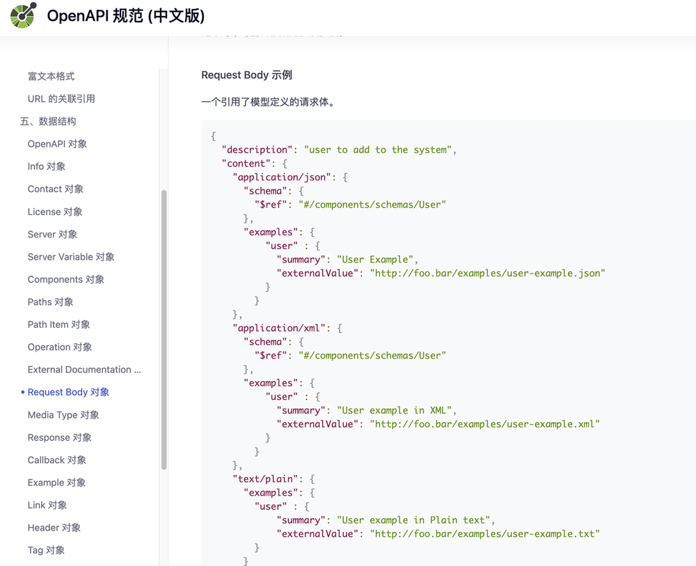

<!-- START doctoc generated TOC please keep comment here to allow auto update -->
<!-- DON'T EDIT THIS SECTION, INSTEAD RE-RUN doctoc TO UPDATE -->
**Table of Contents**  *generated with [DocToc](https://github.com/thlorenz/doctoc)*

- [OpenAPI](#openapi)
  - [Swagger 与 OpenAPI 的区别](#swagger-%E4%B8%8E-openapi-%E7%9A%84%E5%8C%BA%E5%88%AB)
  - [参考](#%E5%8F%82%E8%80%83)

<!-- END doctoc generated TOC please keep comment here to allow auto update -->

# OpenAPI

OpenAPI 是规范化描述 API 领域应用最广泛的行业标准，由 OpenAPI Initiative(OAI) 定义并维护，同时也是 Linux 基金会下的一个开源项目。

通常我们所说的 OpenAPI 全称应该是 OpenAPI Specification(OpenAPI 规范，简称 OSA)，它使用规定的格式来描述 HTTP RESTful API 的定义，以此来规范 RESTful 服务开发过程。使用 JSON 或 YAML 来描述一个标准的、与编程语言无关的 HTTP API 接口。

OpenAPI 规范最初基于 SmartBear Software 在 2015 年捐赠的 Swagger 规范演变而来，目前最新的版本是 v3.1.0。

## Swagger 与 OpenAPI 的区别

Swagger 是一种用于描述 RESTful API 的规范。它提供了一种简单的方式来描述 API 的请求和响应参数、错误码、返回数据类型等信息，使得开发者可以更加方便地了解 API 的使用方式。

OpenAPI 是 Swagger 的后继者。它是一种用于描述 RESTful API 的规范，以 YAML 或 JSON 格式编写。OpenAPI 提供了一些高级功能，如请求和响应的验证、参数传递方式等。
它是由 OpenAPI Initiative（OAI）开发和维护的。

理解差异的最简单方法是

OpenAPI = 规范
Swagger = 用于实现规范的工具

在 OpenAPI 尚未出现之前，Swagger 代表了 Swagger 规范以及一系列围绕 Swagger 规范的开源工具集。
Swagger 规范最后一个版本是 2.0，之后就捐赠给了 OAI 并被重新命名为 OpenAPI 规范，所以 OpenAPI 规范第一个版本是 2.0，也就是 Swagger 规范 2.0，
而由 OAI 这个组织发布的第一个 OpenAPI 规范正式版本是 3.0.0。

Swagger 生态系统始终由规范及其周围的核心开源工具组成，最著名的是 Swagger UI、Swagger Editor 和 Swagger Codegen

在 Go 语言生态里，目前有两个比较流行的开源工具可以生成 Swagger 文档，分别是 go-swagger 和 swag

## 参考
- https://github.com/swaggo/swag
- https://github.com/go-swagger/go-swagger
- [OpenAPI 3.0.0 规范 (中文版)](https://openapi.apifox.cn/)
- [使用 OpenAPI 构建 API 文档](https://xie.infoq.cn/article/ac5194d741e079ba733cb7697)