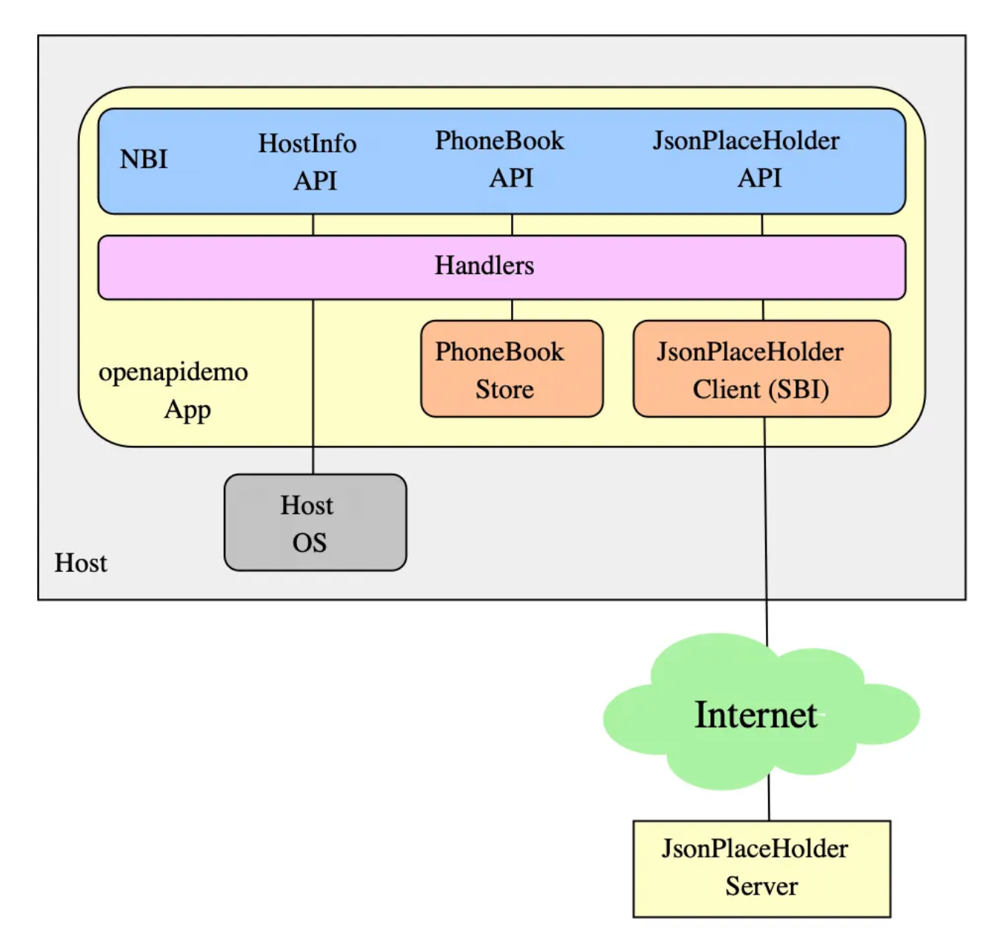

<!-- START doctoc generated TOC please keep comment here to allow auto update -->
<!-- DON'T EDIT THIS SECTION, INSTEAD RE-RUN doctoc TO UPDATE -->
**Table of Contents**  *generated with [DocToc](https://github.com/thlorenz/doctoc)*

- [OpenAPI](#openapi)
  - [Swagger 与 OpenAPI 的区别](#swagger-%E4%B8%8E-openapi-%E7%9A%84%E5%8C%BA%E5%88%AB)
  - [命令行使用](#%E5%91%BD%E4%BB%A4%E8%A1%8C%E4%BD%BF%E7%94%A8)
  - [项目参考使用](#%E9%A1%B9%E7%9B%AE%E5%8F%82%E8%80%83%E4%BD%BF%E7%94%A8)
  - [第三方使用-->cilium](#%E7%AC%AC%E4%B8%89%E6%96%B9%E4%BD%BF%E7%94%A8--cilium)
  - [参考](#%E5%8F%82%E8%80%83)

<!-- END doctoc generated TOC please keep comment here to allow auto update -->

# OpenAPI


OpenAPI 是规范化描述 API 领域应用最广泛的行业标准，由 OpenAPI Initiative(OAI) 定义并维护，同时也是 Linux 基金会下的一个开源项目。

通常我们所说的 OpenAPI 全称应该是 OpenAPI Specification(OpenAPI 规范，简称 OSA)，它使用规定的格式来描述 HTTP RESTful API 的定义，以此来规范 RESTful 服务开发过程。使用 JSON 或 YAML 来描述一个标准的、与编程语言无关的 HTTP API 接口。

OpenAPI 规范最初基于 SmartBear Software 在 2015 年捐赠的 Swagger 规范演变而来，目前最新的版本是 v3.1.0。

## Swagger 与 OpenAPI 的区别

Swagger 是一种用于描述 RESTful API 的规范。它提供了一种简单的方式来描述 API 的请求和响应参数、错误码、返回数据类型等信息，使得开发者可以更加方便地了解 API 的使用方式。

OpenAPI 是 Swagger 的后继者。它是一种用于描述 RESTful API 的规范，以 YAML 或 JSON 格式编写。OpenAPI 提供了一些高级功能，如请求和响应的验证、参数传递方式等。
它是由 OpenAPI Initiative（OAI）开发和维护的。


理解差异的最简单方法是

OpenAPI = 规范
Swagger = 用于实现规范的工具


在 OpenAPI 尚未出现之前，Swagger 代表了 Swagger 规范以及一系列围绕 Swagger 规范的开源工具集。
Swagger 规范最后一个版本是 2.0，之后就捐赠给了 OAI 并被重新命名为 OpenAPI 规范，所以 OpenAPI 规范第一个版本是 2.0，也就是 Swagger 规范 2.0，
而由 OAI 这个组织发布的第一个 OpenAPI 规范正式版本是 3.0.0。


Swagger 生态系统始终由规范及其周围的核心开源工具组成，最著名的是 Swagger UI、Swagger Editor 和 Swagger Codegen


在 Go 语言生态里，目前有两个比较流行的开源工具可以生成 Swagger 文档，分别是 go-swagger 和 swag


## 命令行使用

```shell
~  swagger version
version: v0.33.1
commit: (unknown, mod sum: "h1:BdtmxCvMxkrYIGAyn/qXPi4j85mFTwG4c9ED/27jtq4=")
~  swagger generate --help
Usage:
  swagger [OPTIONS] generate <command>

generate go code for the swagger spec file

Application Options:
  -q, --quiet                  silence logs
      --log-output=LOG-FILE    redirect logs to file

Help Options:
  -h, --help                   Show this help message

Available commands:
  cli        generate a command line client tool from the swagger spec
  client     generate all the files for a client library
  markdown   generate a markdown representation from the swagger spec
  model      generate one or more models from the swagger spec
  operation  generate one or more server operations from the swagger spec
  server     generate all the files for a server application
  spec       generate a swagger spec document from a go application
  support    generate supporting files like the main function and the api builder
```

## 项目参考使用

- 使用说明 https://www.51cto.com/article/823621.html, 代码实现: https://gitlab.com/adrolet/openapidemo/

构建一个名为 openapidemo 的示例应用程序，它包含三个主要组件：

- HostInfo服务：返回运行应用程序的主机基本信息（GET方法）
- PhoneBook服务：一个简单的电话簿，支持存储和检索联系人信息（GET、PUT方法）
- JSONPlaceholder客户端：与外部JSONPlaceholder服务交互的客户端（GET、POST方法）

应用程序采用分层架构：

- 顶层：接受外部REST调用的北向接口 the Northbound Interface (NBI) 
- 底层：各种数据提供者，包括操作系统调用、内部数据存储和REST客户端
- 中间层：处理函数集合，提供 NBI API的行为并充当上下层之间的胶水- 
```shell
(⎈|kubeasz-test:monitoring)➜  42_go-openapi git:(master) ✗ tree -L 2 .
.
├── Makefile
├── handlers
│   ├── handlers.go
│   └── phone_book.go
├── nbi # the Northbound Interface (NBI) 
│   ├── gen
│   ├── nbi-swagger.yaml
│   └── old-configs
├── open-api.md
├── open-api.png
└── sbis # a South Bound Interface (SBI)
    └── jsonplaceholder

```

## 第三方使用-->cilium

swagger 文件定义 

```yaml
# cilium/api/v1/openapi.yaml
---
swagger: '2.0'
info:
  title: Cilium API
  description: Cilium
  version: v1beta1
x-schemes:
- unix
basePath: "/v1"
produces:
- application/json
consumes:
- application/json
paths:
# ....
```


makefile 配置
```makefile
# cilium/Makefile
generate-api: api/v1/openapi.yaml ## Generate cilium-agent client, model and server code from openapi spec.
	@$(ECHO_GEN)api/v1/openapi.yaml
	$(QUIET)$(SWAGGER) generate server -s server -a restapi \
		-t api/v1 \
		-f api/v1/openapi.yaml \
		--default-scheme=unix \
		-C api/v1/cilium-server.yml \
		-r hack/spdx-copyright-header.txt
	$(QUIET)$(SWAGGER) generate client -a restapi \
		-t api/v1 \
		-f api/v1/openapi.yaml \
		-C api/v1/cilium-client.yml \
		-r hack/spdx-copyright-header.txt
	@# sort goimports automatically
	$(QUIET)$(GO) run golang.org/x/tools/cmd/goimports -w ./api/v1/client ./api/v1/models ./api/v1/server
```
* --target ../../v1 指定代码输出的 目标目录
* --name CiliumAPI 名字为 CiliumAPI,不用默认是 info.title
* --server-package server 使用 server 作为目录,不用默认restapi
* --default-scheme unix 使用 unix 协议
* --config-file  api/v1/cilium-server.yml 指定模版配置文件


解析配置
```go
var SpecCell = cell.Module(
	"cilium-api-spec",
	"cilium API Specification",

	cell.Config(defaultServerConfig),
	cell.Provide(newSpec),
)

type Spec struct {
	*loads.Document

	// DeniedAPIs is a set of APIs that are administratively disabled.
	DeniedAPIs api.PathSet
}

// 初始化 spec 
func newSpec(cfg ServerConfig) (*Spec, error) {
	// 解析 swagger json 文件
	swaggerSpec, err := loads.Analyzed(SwaggerJSON, "")
	if err != nil {
		return nil, fmt.Errorf("failed to load swagger spec: %w", err)
	}

	deniedAPIs, err := api.AllowedFlagsToDeniedPaths(swaggerSpec, cfg.EnableCiliumAPIServerAccess)
	if err != nil {
		return nil, fmt.Errorf("failed to parse %q flag: %w",
			AdminEnableFlag, err)
	}

	return &Spec{
		Document:   swaggerSpec,
		DeniedAPIs: deniedAPIs,
	}, nil
}
```

参数依赖注入
```go

type apiParams struct {
	cell.In // 代表以结构体方式参数注入

	Spec *Spec

	Logger *slog.Logger

	Middleware middleware.Builder `name:"cilium-api-middleware" optional:"true"`

	EndpointDeleteEndpointHandler        endpoint.DeleteEndpointHandler
	// ...
}

func newAPI(p apiParams) *restapi.CiliumAPIAPI {
	api := restapi.NewCiliumAPIAPI(p.Spec.Document)

	// Construct the API from the provided handlers

	// 分别定义路由处理的 handler 
	api.EndpointDeleteEndpointHandler = p.EndpointDeleteEndpointHandler
    // ....

	// Inject custom middleware if provided by Hive
	if p.Middleware != nil {
		api.Middleware = func(builder middleware.Builder) http.Handler {
			return p.Middleware(api.Context().APIHandler(builder))
		}
	}

	api.Logger = p.Logger.Info

	return api
}

```


## 参考
- https://github.com/swaggo/swag
- https://github.com/go-swagger/go-swagger
- https://levelup.gitconnected.com/how-to-implement-a-restful-web-service-in-go-using-openapi-swagger-0ec45f89abcc
- [OpenAPI 3.0.0 规范 (中文版)](https://openapi.apifox.cn/)
- [使用 OpenAPI 构建 API 文档](https://xie.infoq.cn/article/ac5194d741e079ba733cb7697)