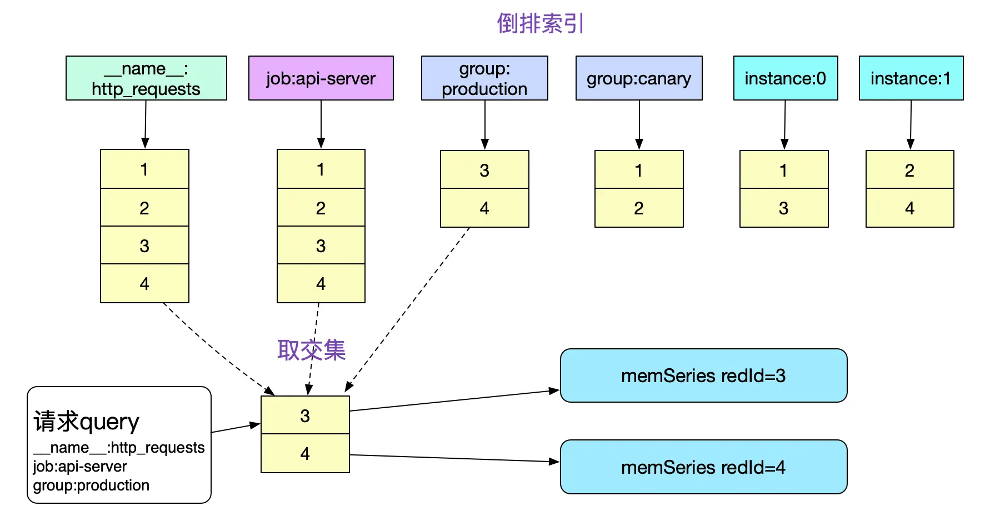

<!-- START doctoc generated TOC please keep comment here to allow auto update -->
<!-- DON'T EDIT THIS SECTION, INSTEAD RE-RUN doctoc TO UPDATE -->
**Table of Contents**  *generated with [DocToc](https://github.com/thlorenz/doctoc)*

- [Prometheus 监控指标查询性能调优](#prometheus-%E7%9B%91%E6%8E%A7%E6%8C%87%E6%A0%87%E6%9F%A5%E8%AF%A2%E6%80%A7%E8%83%BD%E8%B0%83%E4%BC%98)
  - [基本概念](#%E5%9F%BA%E6%9C%AC%E6%A6%82%E5%BF%B5)
  - [数据存储形式](#%E6%95%B0%E6%8D%AE%E5%AD%98%E5%82%A8%E5%BD%A2%E5%BC%8F)
    - [在内存中的组织](#%E5%9C%A8%E5%86%85%E5%AD%98%E4%B8%AD%E7%9A%84%E7%BB%84%E7%BB%87)
    - [在磁盘中的组织](#%E5%9C%A8%E7%A3%81%E7%9B%98%E4%B8%AD%E7%9A%84%E7%BB%84%E7%BB%87)
  - [索引](#%E7%B4%A2%E5%BC%95)
  - [查询过程](#%E6%9F%A5%E8%AF%A2%E8%BF%87%E7%A8%8B)
  - [参考](#%E5%8F%82%E8%80%83)

<!-- END doctoc generated TOC please keep comment here to allow auto update -->

# Prometheus 监控指标查询性能调优

源码基于版本 v2.36.1

## 基本概念


prometheus tsdb中的index以倒排索引的方式组织：

* 给每个series分配1个id

用seriesId查询series，这是前向索引，查询时间复杂度=O(1);

* 构造label的索引

若seriesId={2,5,10,29}都含有label: app='nginx';
那么，对于app='nginx", {2,5,10,29}就是它的倒排索引；


```go
type intersectPostings struct {...}  // 交集
type mergedPostings struct {...} // 并集
type removedPostings struct {...} // 差集
```


## 数据存储形式


### 在内存中的组织

```go
// https://github.com/prometheus/prometheus/blob/4cc25c0cb0b96042a7d36a0dd53dc6970ad607fd/tsdb/head.go

// memSeries is the in-memory representation of a series. None of its methods
// are goroutine safe and it is the caller's responsibility to lock it.
type memSeries struct {
	sync.RWMutex

	ref  chunks.HeadSeriesRef // 其id
	lset labels.Labels // 对应的标签集合

	// Immutable chunks on disk that have not yet gone into a block, in order of ascending time stamps.
	// When compaction runs, chunks get moved into a block and all pointers are shifted like so:
	//
	//                                    /------- let's say these 2 chunks get stored into a block
	//                                    |  |
	// before compaction: mmappedChunks=[p5,p6,p7,p8,p9] firstChunkID=5
	//  after compaction: mmappedChunks=[p7,p8,p9]       firstChunkID=7
	//
	// pN is the pointer to the mmappedChunk referered to by HeadChunkID=N
	mmappedChunks []*mmappedChunk

	mmMaxTime    int64     // Max time of any mmapped chunk, only used during WAL replay.
	headChunk    *memChunk // Most recent chunk in memory that's still being built.
	chunkRange   int64
	firstChunkID chunks.HeadChunkID // HeadChunkID for mmappedChunks[0]

	nextAt int64 // Timestamp at which to cut the next chunk.

	// We keep the last 4 samples here (in addition to appending them to the chunk) so we don't need coordination between appender and querier.
	// Even the most compact encoding of a sample takes 2 bits, so the last byte is not contended.
	sampleBuf [4]sample

	pendingCommit bool // Whether there are samples waiting to be committed to this series.

	// Current appender for the head chunk. Set when a new head chunk is cut.
	// It is nil only if headChunk is nil. E.g. if there was an appender that created a new series, but rolled back the commit
	// (the first sample would create a headChunk, hence appender, but rollback skipped it while the Append() call would create a series).
	app chunkenc.Appender

	memChunkPool *sync.Pool

	// txs is nil if isolation is disabled.
	txs *txRing
}

```

mmappedChunks 设计: 由于chunks文件大小基本固定(最大512M),所以我们很容易的可以通过mmap去访问对应的数据。直接将对应文件的读操作交给操作系统，既省心又省力.

通过一堆标签快速找到对应的 memSeries。
```go
// 寻址 memSeries
type stripeSeries struct {
	size                    int
	series                  []map[chunks.HeadSeriesRef]*memSeries // Sharded by ref. A series ref is the value of `size` when the series was being newly added.
	hashes                  []seriesHashmap                       // Sharded by label hash.
	locks                   []stripeLock                          // Sharded by ref for series access, by label hash for hashes access.
	seriesLifecycleCallback SeriesLifecycleCallback
}

```


### 在磁盘中的组织
```shell
prometheus-data
    |-01EY0EH5JA3ABCB0PXHAPP999D (block)
    |-01EY0EH5JA3QCQB0PXHAPP999D (block)
        |-chunks
            |-000001
            |-000002
            .....
            |-000021
        |-index
        |-meta.json
        |-tombstones
    |-wal
    |-chunks_head
```

## 索引

Prometheus 的数据库被划分为基本的存储单元，称为 block.
最近的Block一般是存储了2小时的数据，而较为久远的Block则会通过compactor进行合并，一个Block可能存储了若干小时的信息。
值得注意的是，合并操作只是减少了索引的大小(尤其是符号表的合并)，而本身数据(chunks)的大小并没有任何改变。


block 中最重要的两个组成部分是 chunks 和 index。
```go
type Block struct {
    // ..
	
	// 保存 block 的元数据信息
	meta BlockMeta

	// Symbol Table Size in bytes.
	// We maintain this variable to avoid recalculation every time.
	symbolTableSize uint64

	chunkr     ChunkReader
	indexr     IndexReader
	
	// 保存已经删除的序列以及关于它们的信息
	tombstones tombstones.Reader

    // ...
}

```
字段说明
- chunks 中保存的是特定序列在一定时间范围内的采样集合，一个 chunk 只包含一个序列的数据。

- index 中保存的是 Prometheus 访问数据使用的索引信息。 在 index 中保存着两种类的索引：postings index 和 series index。
    * postings index：保存着标签与包含该标签的序列之间的对应关系。例如，标签 __name__ ="logback_events_total" 可以被包含在两个序列中，logback_events_total {job="app1", level="error"}和 logback_events_total {job="app2", level="error"}。
    * series index：保存着序列和 chunk 之间的对应关系。例如，序列 {__name__="logback_events_total", job="app1", level="error"} 可能保存在00001和00002两个 chunk 里。


  
```go
func NewRangeHead(head *Head, mint, maxt int64) *RangeHead {
	return &RangeHead{
		head: head,
		mint: mint,
		maxt: maxt,
	}
}

func (h *RangeHead) Index() (IndexReader, error) {
	return h.head.indexRange(h.mint, h.maxt), nil
}


```

内存中，使用headIndexReader，将内存block中的label组织成倒排索引；
```go
func (h *Head) indexRange(mint, maxt int64) *headIndexReader {
	if hmin := h.MinTime(); hmin > mint {
		mint = hmin
	}
	return &headIndexReader{head: h, mint: mint, maxt: maxt}
}
```


block中，使用blockIndexReader，读取block目录中的index文件，将其中的label组织倒排索引；
```go
func (pb *Block) Index() (IndexReader, error) {
	if err := pb.startRead(); err != nil {
		return nil, err
	}
	return blockIndexReader{ir: pb.indexr, b: pb}, nil
}

```

headIndexReader和blockIndexReader实现indexReader，提供了：
```go
type IndexReader interface {
	// Symbols return an iterator over sorted string symbols that may occur in
	// series' labels and indices. It is not safe to use the returned strings
	// beyond the lifetime of the index reader.
	Symbols() index.StringIter

	// SortedLabelValues returns sorted possible label values.
	SortedLabelValues(name string, matchers ...*labels.Matcher) ([]string, error)

	// 查询label key对应的values ,未排序
	LabelValues(name string, matchers ...*labels.Matcher) ([]string, error)

	// Postings returns the postings list iterator for the label pairs.
	// The Postings here contain the offsets to the series inside the index.
	// Found IDs are not strictly required to point to a valid Series, e.g.
	// during background garbage collections. Input values must be sorted.
	// 查询label key/value对应的[]seriesId；
	Postings(name string, values ...string) (index.Postings, error)

	// SortedPostings returns a postings list that is reordered to be sorted
	// by the label set of the underlying series.
	SortedPostings(index.Postings) index.Postings

	// Series populates the given labels and chunk metas for the series identified
	// by the reference.
	// Returns storage.ErrNotFound if the ref does not resolve to a known series.
	Series(ref storage.SeriesRef, lset *labels.Labels, chks *[]chunks.Meta) error

	// 所有的已经排序 Label key；
	LabelNames(matchers ...*labels.Matcher) ([]string, error)

	// LabelValueFor returns label value for the given label name in the series referred to by ID.
	// If the series couldn't be found or the series doesn't have the requested label a
	// storage.ErrNotFound is returned as error.
	LabelValueFor(id storage.SeriesRef, label string) (string, error)

	// LabelNamesFor returns all the label names for the series referred to by IDs.
	// The names returned are sorted.
	LabelNamesFor(ids ...storage.SeriesRef) ([]string, error)

	// Close releases the underlying resources of the reader.
	Close() error
}

```


block 中还包含了一个 meta.json 文件（保存 block 的元数据信息）和 一个 tombstones 文件（保存已经删除的序列以及关于它们的信息）。


## 查询过程

Prometheus 的查询处理通常包含以下五个基本步骤：


1. 通过查询的时间范围确定对应的 block。

2. 通过 postings index 确定与标签匹配的序列。

3. 通过 series index 确定这些序列对应的 chunk。

4. 从这些 chunk 中检索样本数据。

5. 如果查询中包含操作符、聚合操作或内置函数，还需要基于样本数据进行二次计算。


1) 查询入口：加载内存block和磁盘block，构造出blockQuerier
```go
// Querier returns a new querier over the data partition for the given time range.
func (db *DB) Querier(_ context.Context, mint, maxt int64) (storage.Querier, error) {
	var blocks []BlockReader

	db.mtx.RLock()
	defer db.mtx.RUnlock()
    //   磁盘block
	for _, b := range db.blocks {
		if b.OverlapsClosedInterval(mint, maxt) {
			blocks = append(blocks, b)
		}
	}
	var headQuerier storage.Querier
	if maxt >= db.head.MinTime() {
		// 内存
		rh := NewRangeHead(db.head, mint, maxt)
		var err error
		headQuerier, err = NewBlockQuerier(rh, mint, maxt)
		if err != nil {
			return nil, errors.Wrapf(err, "open querier for head %s", rh)
		}

		// Getting the querier above registers itself in the queue that the truncation waits on.
		// So if the querier is currently not colliding with any truncation, we can continue to use it and still
		// won't run into a race later since any truncation that comes after will wait on this querier if it overlaps.
		shouldClose, getNew, newMint := db.head.IsQuerierCollidingWithTruncation(mint, maxt)
		if shouldClose {
			if err := headQuerier.Close(); err != nil {
				return nil, errors.Wrapf(err, "closing head querier %s", rh)
			}
			headQuerier = nil
		}
		if getNew {
			rh := NewRangeHead(db.head, newMint, maxt)
			headQuerier, err = NewBlockQuerier(rh, newMint, maxt)
			if err != nil {
				return nil, errors.Wrapf(err, "open querier for head while getting new querier %s", rh)
			}
		}
	}

	blockQueriers := make([]storage.Querier, 0, len(blocks))
	for _, b := range blocks {
		// block中
		q, err := NewBlockQuerier(b, mint, maxt)
		if err == nil {
			blockQueriers = append(blockQueriers, q)
			continue
		}
		// If we fail, all previously opened queriers must be closed.
		for _, q := range blockQueriers {
			// TODO(bwplotka): Handle error.
			_ = q.Close()
		}
		return nil, errors.Wrapf(err, "open querier for block %s", b)
	}
	if headQuerier != nil { // 如果存在内存 headQuerier
		blockQueriers = append(blockQueriers, headQuerier)
	}
	return storage.NewMergeQuerier(blockQueriers, nil, storage.ChainedSeriesMerge), nil
}
```


## 参考
- [Prometheus TSDB (Part 1): The Head Block](https://ganeshvernekar.com/blog/prometheus-tsdb-the-head-block/)
- [Prometheus TSDB (Part 2): WAL and Checkpoint](https://ganeshvernekar.com/blog/prometheus-tsdb-wal-and-checkpoint/)
- [Prometheus TSDB (Part 3): Memory Mapping of Head Chunks from Disk](https://ganeshvernekar.com/blog/prometheus-tsdb-mmapping-head-chunks-from-disk/)
- [Prometheus 时序数据库 - 内存中的存储结构](https://my.oschina.net/alchemystar/blog/4958530)
- [Prometheus 时序数据库 - 磁盘中的存储结构](https://mp.weixin.qq.com/s/sL9YolmiDnSX6Oogk_2vxQ)
- [Prometheus监控指标查询性能调优](https://www.cnblogs.com/88223100/p/Prometheus-monitoring-metrics-query-performance-tuning.html)
- [index倒排索引](https://segmentfault.com/a/1190000041210003)