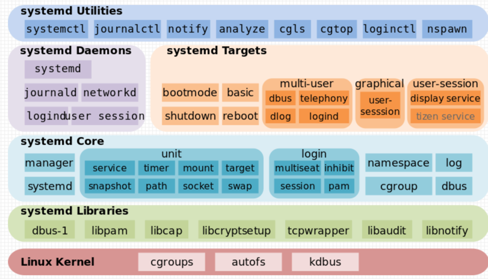

<!-- START doctoc generated TOC please keep comment here to allow auto update -->
<!-- DON'T EDIT THIS SECTION, INSTEAD RE-RUN doctoc TO UPDATE -->
**Table of Contents**  *generated with [DocToc](https://github.com/thlorenz/doctoc)*

- [systemd](#systemd)
  - [Linux 启动流程](#linux-%E5%90%AF%E5%8A%A8%E6%B5%81%E7%A8%8B)
  - [systemd 体系架构](#systemd-%E4%BD%93%E7%B3%BB%E6%9E%B6%E6%9E%84)
  - [systemd unit](#systemd-unit)
    - [service](#service)
    - [mount](#mount)
  - [管理 systemd](#%E7%AE%A1%E7%90%86-systemd)
  - [go-systemd](#go-systemd)
    - [第三方应用](#%E7%AC%AC%E4%B8%89%E6%96%B9%E5%BA%94%E7%94%A8)
  - [参考](#%E5%8F%82%E8%80%83)

<!-- END doctoc generated TOC please keep comment here to allow auto update -->

# systemd
System daemon(系统守护进程，简称 systemd)  是一个 Linux 系统基础组件的集合，提供了一个系统和服务管理器，运行为 PID 1 并负责启动其它程序。功能包括：

- 支持并行化任务；
- 同时采用 socket 式与 D-Bus 总线式激活服务；
- 按需启动守护进程（daemon）；
- 利用 Linux 的 cgroups 监视进程；
- 支持快照和系统恢复；
- 维护挂载点和自动挂载点；
- 各服务间基于依赖关系进行精密控制。
- systemd* 支持 SysV 和 LSB 初始脚本，可以替代 sysvinit。
- 除此之外，功能还包括日志进程、控制基础系统配置，维护登陆用户列表以及系统账户、运行时目录和设置，可以运行容器和虚拟机，可以简单的管理网络配置、网络时间同步、日志转发和名称解析等

## Linux 启动流程

Linux 从按下电源键到进入用户交互界面整个启动流程大致可以分为四个阶段：

- BIOS 阶段
- BootLoader 阶段
- kernel 加载阶段
- init：systemd/sysvinit 初始化阶段

## systemd 体系架构


- 最底层：systemd 内核层面依赖 cgroup、autofs、kdbus
- 第二层：systemd libraries 是 systemd 依赖库
- 第三层：systemd Core 是 systemd 自己的库
- 第四层：systemd daemons 以及 targets 是自带的一些基本 unit、target，类似于 sysvinit 中自带的脚本
- 最上层就是和 systemd 交互的一些工具


## systemd unit
Systemd 将各种操作系统启动和运行的相关对象，抽象多种类型的 Units(单元)，并且提供了 Units 之间的依赖关系。


| type |     name     | 作用 |
| :--: |:------------:| :--: |
| Service unit |   .service   | 用于封装一个后台服务进程 |
| Target unit |   .target    | 用于将多个单元Unit在逻辑上组合在一起。 |
| Device unit |   .device    | 用于定义内核识别的设备，在 sysfs(5) 里面作为 udev(7) 设备树展示 |
| Socket unit |   .socket    | 用于标识进程间通信用到的 socket 文件 |
| Snapshot unit |  .snapshot   | 管理系统快照 |
| Swap unit |    .swap     | 用于标识 swap 文件或设备 |
| Mount unit |    .mount    | 用于封装一个文件系统挂载点(也向后兼容传统的 /etc/fstab 文件) |
|Automount unit | .automount	  | 用于封装一个文件系统自动挂载点 |
| Path unit |    .path     | 用于根据文件系统上特定对象的变化来启动其他服务。 |
| Time unit|    .timer    | 用于封装一个基于时间触发的动作。取代传统的 crond 等任务计划服务 |
| Slice unit|   *.slice    | 用于控制特定 CGroup 内所有进程的总体资源占用。|


```shell
# man systemd.unit
UNIT LOAD PATH
       Unit files are loaded from a set of paths determined during compilation, described in the two tables below.
       Unit files found in directories listed earlier override files with the same name in directories lower in
       the list.

       Table 1.  Load path when running in system mode (--system).
       ┌────────────────────────┬─────────────────────────────┐
       │Path                    │ Description                 │
       ├────────────────────────┼─────────────────────────────┤
       │/etc/systemd/system     │ Local configuration         │
       ├────────────────────────┼─────────────────────────────┤
       │/run/systemd/system     │ Runtime units               │
       ├────────────────────────┼─────────────────────────────┤
       │/usr/lib/systemd/system │ Units of installed packages │
       └────────────────────────┴─────────────────────────────┘
```

这三个目录的配置文件优先级依次从高到低，如果同一选项三个地方都配置了，优先级高的会覆盖优先级低的

### service 
```service
[Unit]

Description=nginx - high performance web server

Documentation=http://nginx.org/en/docs/

After=network.target remote-fs.target nss-lookup.target

[Service]

Type=forking

PIDFile=/usr/local/nginx/logs/nginx.pid

ExecStartPre=/usr/local/nginx/sbin/nginx -t -c /usr/local/nginx/conf/nginx.conf

ExecStart=/usr/local/nginx/sbin/nginx -c /usr/local/nginx/conf/nginx.conf

ExecReload=/bin/kill -s HUP $MAINPID

ExecStop=/bin/kill -s QUIT $MAINPID

PrivateTmp=true

[Install]

WantedBy=multi-user.target
```
[Unit]
- Description : 服务的简单描述

- Documentation ： 服务文档

- After: 当前服务（<software-name>.service）需要在这些服务启动后，才启动
  Before: 和 After 相反，当前服务需要在这些服务启动前，先启动
  Wants：表示当前服务"弱依赖"于这些服务。即当前服务依赖于它们，但是没有它们，当前服务也能正常运行。
  Requires: 表示"强依赖"关系，即如果该服务启动失败或异常退出，那么当前服务也必须退出。

[Service]
- Type : 启动类型 simple、forking、oneshot、notify、dbus

  - Type=simple（默认值）：systemd 认为该服务将立即启动，服务进程不会 fork。如果该服务要启动其他服务，不要使用此类型启动，除非该服务是 socket 激活型

  - Type=forking：systemd 认为当该服务进程 fork，且父进程退出后服务启动成功。对于常规的守护进程（daemon），除非你确定此启动方式无法满足需求， 使用此类型启动即可。使用此启动类型应同时指定 PIDFile=，以便 systemd 能够跟踪服务的主进程。

  - Type=oneshot：这一选项适用于只执行一项任务、随后立即退出的服务。可能需要同时设置 RemainAfterExit=yes 使得 systemd 在服务进程退出之后仍然认为服务处于激活状态。

  - Type=notify：与 Type=simple 相同，但约定服务会在就绪后向 systemd 发送一个信号，这一通知的实现由 libsystemd-daemon.so 提供
    - 细节：systemd 会创建一个 unix socket，并将地址通过 $NOTIFY_SOCKET 环境变量提供给服务，同时监听该 socket 上的信号。服务可以使用 systemd 提供的 C 函数 sd_notify() 或者命令行工具 systemd-notify 发送信号给 systemd.

  - Type=dbus：若以此方式启动，当指定的 BusName 出现在 DBus 系统总线上时，systemd 认为服务就绪。

- PIDFile ： pid 文件路径

- Environment ： 环境变量（可以添加多个）eg ：Environment=REPO_REF=dev

- ExecStartPre ：启动前要做什么，上文中是测试配置文件 －t

- ExecStart：服务的具体运行命令（对非 workingdirectory 的文件，必须用绝对路径！

- ExecReload：重载命令，如果程序支持 HUP 信号的话，通常将此项设为 `/bin/kill -HUP $MAINPID`

- ExecStop：停止命令

- PrivateTmp：True 表示给服务分配独立的临时空间

程序的 user 和 group
- User=ryan 
- Group=ryan

[Install] 定义如何安装这个配置文件，即怎样做到开机启动。
Target的含义是服务组，表示一组服务。
WantedBy=multi-user.target

### mount
mount 单元既可以通过单元文件进行配置， 也可以通过 /etc/fstab 文件(参见 fstab(5) 手册)进行配置。 /etc/fstab 中的挂载点将在每次重新加载 systemd 配置时(包括系统启动时) 动态的自动转化为 mount 单元。
现在很多发行版都开始慢慢抛弃 fstab.
```shell
[root@master-01 ~]# systemctl cat tmp.mount
# /usr/lib/systemd/system/tmp.mount
#  This file is part of systemd.
#
#  systemd is free software; you can redistribute it and/or modify it
#  under the terms of the GNU Lesser General Public License as published by
#  the Free Software Foundation; either version 2.1 of the License, or
#  (at your option) any later version.

[Unit]
Description=Temporary Directory
Documentation=man:hier(7)
Documentation=http://www.freedesktop.org/wiki/Software/systemd/APIFileSystems
ConditionPathIsSymbolicLink=!/tmp
DefaultDependencies=no
Conflicts=umount.target
Before=local-fs.target umount.target

[Mount]
What=tmpfs
Where=/tmp
Type=tmpfs
Options=mode=1777,strictatime

# Make 'systemctl enable tmp.mount' work:
[Install]
WantedBy=local-fs.target
```

- What=绝对路径形式表示的被挂载对象：设备节点、LOOP 文件、其他资源(例如网络资源)。 详见 mount(8) 手册。 如果是一个设备节点，那么将会自动添加对此设备节点单元的依赖(参见 systemd.device(5) 手册)。 这是一个必需的设置。注意，因为可以在此选项中使用 “%” 系列替换标记， 所以百分号(%)应该使用 %% 表示。
- Where=绝对路径形式表示的挂载点目录。 注意，不可设为一个软连接(即使它实际指向了一个目录)。 如果挂载时此目录不存在，那么将尝试创建它。 注意，这里设置的绝对路径必须与单元文件的名称相对应(见上文)。 这是一个必需的设置。
- Type=字符串形式表示的文件系统类型。详见 mount(8) 手册。这是一个可选的设置。
- Options=一组逗号分隔的挂载选项。详见 mount(8) 手册。 这是一个可选的设置。注意，因为可以在此选项中使用 “%” 系列替换标记， 所以百分号(%)应该使用 %% 表示。
- SloppyOptions=设为 yes 表示允许在 Options= 中使用文件系统不支持的挂载选项， 且不会导致挂载失败(相当于使用了 mount(8) 的 -s 命令行选项)。 默认值 no 表示禁止在 Options= 中使用文件系统不支持的挂载选项(会导致挂载失败)。
- LazyUnmount=设置是否使用延迟卸载。 设为 yes 表示立即将文件系统从当前的挂载点分离， 但是一直等待到设备不再忙碌的时候， 才会清理所有对此文件系统的引用(也就是真正完成卸载)。 这相当于使用 umount(8) 的 -l 选项进行卸载。 默认值为 no
- ForceUnmount=设置是否使用强制卸载。 设为 yes 表示使用强制卸载(仅建议用于 NFS 文件系统)。 这相当于使用 umount(8) 的 -f 选项进行卸载。 默认值为 no
- DirectoryMode=自动创建挂载点目录(包括必要的上级目录)时， 所使用的权限模式(八进制表示法)。 默认值是 0755
- TimeoutSec=最大允许使用多长时间以完成挂载动作。 若超时则被视为挂载失败， 并且所有当前正在运行的命令都将被以 SIGTERM 信号终止； 若继续等待相同的时长之后命令仍未终止， 那么将使用 SIGKILL 信号强制终止 (详见 systemd.kill(5) 中的 KillMode= 选项)。 可以使用 “ms”, “s”, “min”, “h” 这样的时间单位后缀。 若省略后缀则表示单位是秒。 设为零表示永不超时。 默认值为 DefaultTimeoutStartSec= 选项的值 (参见 systemd-system.conf(5) 手册)。


## 管理 systemd

控制 systemd 的主要命令主要有以下几种：

- systemctl 命令控制 systemd 的管理系统和服务的命令行工具
```shell
# 自启动
systemctl enable nginx.service

# 禁止自启动
systemctl disable nginx.service

# 启动服务
systemctl start nginx.service

# 停止服务
systemctl stop nginx.service

# 重启服务
systemctl restart nginx.service

# 查看Unit定义文件
systemctl cat nginx.service

# 编辑Unit定义文件
systemctl edit nginx.service

# 重新加载Unit定义文件
systemctl reload nginx.service

# 列出已启动的所有unit，就是已经被加载到内存中
systemctl list-units

# 列出系统已经安装的所有unit，包括那些没有被加载到内存中的unit
systemctl list-unit-files

# 查看服务的日志
journalctl -u nginx.service    # 还可以配合`-b`一起使用，只查看自本次系统启动以来的日志

# 查看所有target下的unit
systemctl list-unit-files --type=target

# 查看默认target，即默认的运行级别。对应于旧的`runlevel`命令
systemctl get-default

# 设置默认的target
systemctl set-default multi-user.target

# 查看某一target下的unit
systemctl list-dependencies multi-user.target

# 切换target，不属于新target的unit都会被停止
systemctl isolate multi-user.target
systemctl poweroff    # 关机
systemctl reboot       # 重启
systemctl rescue    # 进入rescue模式
```

- systemsdm 命令控制 systemd 的管理和服务的图形化工具
- journalctl 命令查詢 systemd 日志系统
- loginctl 命令控制 systemd 登入管理器
```shell
$ loginctl list-sessions    # 列出当前session
$ loginctl list-users       # 列出当前登录用户
$ loginctl show-user ruanyf # 列出显示指定用户的信息
```
- systemd-analyze 分析系统启动效能（类似开机时间)


## go-systemd

go-systemd 项目包含多个核心功能包，具体如下：

套接字激活 (activation)：支持使用 systemd 的套接字激活功能，允许服务在接收到连接请求时才启动，从而提高系统的资源利用率和响应速度。

守护进程管理 (daemon)：实现 systemd 的 sd_notify 协议，用于通知 systemd 服务的状态变化，如启动完成、看门狗事件等。

D-Bus 通信 (dbus)：连接到 systemd 的 D-Bus API，允许开发者启动、停止和检查 systemd 单元的状态。

日志记录 (journal)：提供直接向 systemd 日志服务 (journald) 提交日志条目的功能，支持索引键值对，便于日志管理和查询。

日志读取 (sdjournal)：通过封装 journald 的 C API，提供对日志的读取访问，需要 cgo 和日志头文件的支持。

logind 集成 (login1)：提供与 systemd logind API 的集成功能。

machined 集成 (machine1)：允许与 systemd machined D-Bus API 进行交互。

单元文件管理 (unit)：提供对 systemd 单元文件的序列化、反序列化和比较功能

### 第三方应用
k8s 守护进程管理:通知 systemd 服务的状态变化
```go
// https://github.com/kubernetes/kubernetes/blob/4b8ec54d8e5ede787e2f94343d0723462f430127/staging/src/k8s.io/apiserver/pkg/server/genericapiserver.go
func (s preparedGenericAPIServer) NonBlockingRun(stopCh <-chan struct{}, shutdownTimeout time.Duration) (<-chan struct{}, <-chan struct{}, error) {
	// ...

	if _, err := systemd.SdNotify(true, "READY=1\n"); err != nil {
		klog.Errorf("Unable to send systemd daemon successful start message: %v\n", err)
	}

	return stoppedCh, listenerStoppedCh, nil
}
```

```go
// github.com/coreos/go-systemd/v22/daemon/sdnotify.go
func SdNotify(unsetEnvironment bool, state string) (bool, error) {
	socketAddr := &net.UnixAddr{
		Name: os.Getenv("NOTIFY_SOCKET"),
		Net:  "unixgram",
	}

	// NOTIFY_SOCKET not set
	if socketAddr.Name == "" {
		return false, nil
	}

	if unsetEnvironment {
		if err := os.Unsetenv("NOTIFY_SOCKET"); err != nil {
			return false, err
		}
	}

	conn, err := net.DialUnix(socketAddr.Net, nil, socketAddr)
	// Error connecting to NOTIFY_SOCKET
	if err != nil {
		return false, err
	}
	defer conn.Close()

	if _, err = conn.Write([]byte(state)); err != nil {
		return false, err
	}
	return true, nil
}
```


etcd journal: 提交日志条目

```go
// https://github.com/etcd-io/etcd/blob/e0fc9386bc3fe74e9bf32ff7da26158af9a00842/vendor/github.com/coreos/go-systemd/journal/journal.go
func (w *journalWriter) Write(p []byte) (int, error) {
	line := &logLine{}
	if err := json.NewDecoder(bytes.NewReader(p)).Decode(line); err != nil {
		return 0, err
	}

	var pri journal.Priority
	switch line.Level {
	case zapcore.DebugLevel.String():
		pri = journal.PriDebug
    // ...

	default:
		panic(fmt.Errorf("unknown log level: %q", line.Level))
	}

	err := journal.Send(string(p), pri, map[string]string{
		"PACKAGE":           filepath.Dir(line.Caller),
		"SYSLOG_IDENTIFIER": filepath.Base(os.Args[0]),
	})
	if err != nil {
		// "journal" also falls back to stderr
		// "fmt.Fprintln(os.Stderr, s)"
		return w.Writer.Write(p)
	}
	return 0, nil
}

```
```go
// https://github.com/etcd-io/etcd/blob/e0fc9386bc3fe74e9bf32ff7da26158af9a00842/vendor/github.com/coreos/go-systemd/journal/journal.go
func Send(message string, priority Priority, vars map[string]string) error {
	if conn == nil {
		return journalError("could not connect to journald socket")
	}

	data := new(bytes.Buffer)
	appendVariable(data, "PRIORITY", strconv.Itoa(int(priority)))
	appendVariable(data, "MESSAGE", message)
	for k, v := range vars {
		appendVariable(data, k, v)
	}

	_, err := io.Copy(conn, data)
	if err != nil && isSocketSpaceError(err) {
        // ...
	} else if err != nil {
		return journalError(err.Error())
	}
	return nil
}
```

## 参考
- [Linux 的小伙伴 systemd 详解](https://blog.k8s.li/systemd.html)
- [利用 systemd 部署 golang 项目](https://learnku.com/articles/34025)
- [Systemd 学习资料](https://desistdaydream.github.io/docs/1.%E6%93%8D%E4%BD%9C%E7%B3%BB%E7%BB%9F/Systemd/)
- [systemd.service 中文手册](https://www.cnblogs.com/duyinqiang/p/5696330.html)