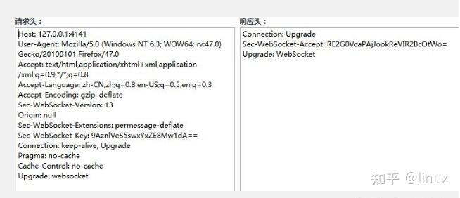

<!-- START doctoc generated TOC please keep comment here to allow auto update -->
<!-- DON'T EDIT THIS SECTION, INSTEAD RE-RUN doctoc TO UPDATE -->
**Table of Contents**  *generated with [DocToc](https://github.com/thlorenz/doctoc)*

- [websocket](#websocket)
  - [gorilla/websocket](#gorillawebsocket)
    - [Upgrader 实例](#upgrader-%E5%AE%9E%E4%BE%8B)
    - [类型](#%E7%B1%BB%E5%9E%8B)
    - [Upgrade 升级协议获取连接conn](#upgrade-%E5%8D%87%E7%BA%A7%E5%8D%8F%E8%AE%AE%E8%8E%B7%E5%8F%96%E8%BF%9E%E6%8E%A5conn)
  - [参考](#%E5%8F%82%E8%80%83)

<!-- END doctoc generated TOC please keep comment here to allow auto update -->

# websocket

WebSocket 是 HTML5 开始推出的基于 TCP 协议的双向通信协议，其优势在于与 HTTP 协议兼容、开销小、通信高效。WebSocket 让客户端和服务器之间建立连接，并通过这个持久连接实时地进行双向数据传输。


服务器发起中断请求为止。WebSocket 通过 HTTP/1.1 协议中的 Upgrade 头信息来告诉服务器，希望协议从 HTTP/1.1 升级到 WebSocket 协议


一旦建立了 WebSocket 连接，客户端和服务器端就可以互相发送二进制流或 Unicode 字符串。所有的数据都是经过 mask 处理过的，mask 的值是由服务器端随机生成的。在数据进行发送之前，必须先进行 mask 处理，这样可以有效防止数据被第三方恶意篡改。

## gorilla/websocket

gorilla/websocket库是 RFC 6455 定义的websocket协议的一种实现.
在数据收发方面，提供Data Messages、Control Messages两类message粒度的读写API；
性能方面，提供Buffers和Compression的相关配置选项；
安全方面，可通过CheckOrigin来控制是否支持跨域。




### Upgrader 实例

```go
// github.com/gorilla/websocket@v1.4.2/server.go
type Upgrader struct {
	// 升级 websocket 握手完成的超时时间
	HandshakeTimeout time.Duration

	// io 操作的缓存大小，如果不指定就会自动分配
	ReadBufferSize, WriteBufferSize int

	// 写数据操作的缓存池，如果没有设置值，write buffers 将会分配到连接生命周期里。
	WriteBufferPool BufferPool

	// 按顺序指定服务支持的协议，如值存在，则服务会从第一个开始匹配客户端的协议。
	Subprotocols []string

	// http 的错误响应函数，如果没有设置 Error 则，会生成 http.Error 的错误响应。
	Error func(w http.ResponseWriter, r *http.Request, status int, reason error)

	// 如果请求Origin标头可以接受，CheckOrigin将返回true。 如果CheckOrigin为nil，则使用安全默认值：如果Origin请求头存在且原始主机不等于请求主机头，则返回false。
    // 请求检查函数，用于统一的连接检查，以防止跨站点请求伪造。如果不检查，就设置一个返回值为true的函数
	CheckOrigin func(r *http.Request) bool

	// EnableCompression 指定服务器是否应尝试协商每个消息压缩（RFC 7692）。 将此值设置为true并不能保证将支持压缩。 目前仅支持“无上下文接管”模式
	EnableCompression bool
}
```


### 类型
```go
// The message types are defined in RFC 6455, section 11.8.
const (
	// TextMessage denotes a text data message. The text message payload is
	// interpreted as UTF-8 encoded text data.
	TextMessage = 1

	// BinaryMessage denotes a binary data message.
	BinaryMessage = 2

	// CloseMessage denotes a close control message. The optional message
	// payload contains a numeric code and text. Use the FormatCloseMessage
	// function to format a close message payload.
	CloseMessage = 8

	// PingMessage denotes a ping control message. The optional message payload
	// is UTF-8 encoded text.
	PingMessage = 9

	// PongMessage denotes a pong control message. The optional message payload
	// is UTF-8 encoded text.
	PongMessage = 10
)
```

### Upgrade 升级协议获取连接conn

```go
func (u *Upgrader) Upgrade(w http.ResponseWriter, r *http.Request, responseHeader http.Header) (*Conn, error) {
	const badHandshake = "websocket: the client is not using the websocket protocol: "

    // 校验操作
	
	// 子协议选择
	subprotocol := u.selectSubprotocol(r, responseHeader)

	// Negotiate PMCE
	var compress bool
	if u.EnableCompression {
		for _, ext := range parseExtensions(r.Header) {
			if ext[""] != "permessage-deflate" {
				continue
			}
			compress = true
			break
		}
	}

	h, ok := w.(http.Hijacker)
	if !ok {
		return u.returnError(w, r, http.StatusInternalServerError, "websocket: response does not implement http.Hijacker")
	}
	var brw *bufio.ReadWriter
	netConn, brw, err := h.Hijack()
	if err != nil {
		return u.returnError(w, r, http.StatusInternalServerError, err.Error())
	}

	if brw.Reader.Buffered() > 0 {
		netConn.Close()
		return nil, errors.New("websocket: client sent data before handshake is complete")
	}

	var br *bufio.Reader
	if u.ReadBufferSize == 0 && bufioReaderSize(netConn, brw.Reader) > 256 {
		// Reuse hijacked buffered reader as connection reader.
		br = brw.Reader
	}

	buf := bufioWriterBuffer(netConn, brw.Writer)

	var writeBuf []byte
	if u.WriteBufferPool == nil && u.WriteBufferSize == 0 && len(buf) >= maxFrameHeaderSize+256 {
		// Reuse hijacked write buffer as connection buffer.
		writeBuf = buf
	}

	c := newConn(netConn, true, u.ReadBufferSize, u.WriteBufferSize, u.WriteBufferPool, br, writeBuf)
	c.subprotocol = subprotocol

	if compress {
		c.newCompressionWriter = compressNoContextTakeover
		c.newDecompressionReader = decompressNoContextTakeover
	}

	// Use larger of hijacked buffer and connection write buffer for header.
	p := buf
	if len(c.writeBuf) > len(p) {
		p = c.writeBuf
	}
	p = p[:0]

	p = append(p, "HTTP/1.1 101 Switching Protocols\r\nUpgrade: websocket\r\nConnection: Upgrade\r\nSec-WebSocket-Accept: "...)
	p = append(p, computeAcceptKey(challengeKey)...)
	p = append(p, "\r\n"...)
	if c.subprotocol != "" {
		p = append(p, "Sec-WebSocket-Protocol: "...)
		p = append(p, c.subprotocol...)
		p = append(p, "\r\n"...)
	}
	if compress {
		p = append(p, "Sec-WebSocket-Extensions: permessage-deflate; server_no_context_takeover; client_no_context_takeover\r\n"...)
	}
	for k, vs := range responseHeader {
		if k == "Sec-Websocket-Protocol" {
			continue
		}
		for _, v := range vs {
			p = append(p, k...)
			p = append(p, ": "...)
			for i := 0; i < len(v); i++ {
				b := v[i]
				if b <= 31 {
					// prevent response splitting.
					b = ' '
				}
				p = append(p, b)
			}
			p = append(p, "\r\n"...)
		}
	}
	p = append(p, "\r\n"...)

	// Clear deadlines set by HTTP server.
	netConn.SetDeadline(time.Time{})

	if u.HandshakeTimeout > 0 {
		netConn.SetWriteDeadline(time.Now().Add(u.HandshakeTimeout))
	}
	if _, err = netConn.Write(p); err != nil {
		netConn.Close()
		return nil, err
	}
	if u.HandshakeTimeout > 0 {
		netConn.SetWriteDeadline(time.Time{})
	}

	return c, nil
}
```


## 参考

